## 🏗️ FASE 4: Casos de Uso y Arquitectura de Flujos

### Mapeo de User Stories a Casos de Uso Maestros

Las **14 User Stories** del PRD se agrupan en **3 Flujos Críticos de Sistema (Épicas)** para modelar la arquitectura técnica de interacciones entre componentes.

**Análisis de Dependencias Críticas:**
- **CU-02** (Gestión) requiere que **CU-01** (Ingesta) haya generado metadatos validados en la base de datos.
- **CU-03** (Trazabilidad) requiere el estado base creado por **CU-01** y visualizado en **CU-02**.
- **Orden de Implementación:** CU-01 (P0 - Bloqueante) → CU-02 (P1 - Dependiente) → CU-03 (P1 - Dependiente)

---

### CU-01: Ingesta y Validación (P0 - Critical Core)

**Descripción:**  
"The Gatekeeper" - Garantiza que solo datos validados según ISO-19650 ingresen al sistema. Implementa el concepto de "Garbage Never In" mediante validación activa pre-ingesta.

**User Stories Cubiertas:**
- **US-001:** Upload exitoso con validación automática (Happy Path)
- **US-002:** Rechazo de nomenclatura inválida (Error Path)
- **US-003:** Cancelación de upload en progreso (Error Path)
- **US-004:** Detección de geometría corrupta (Error Path)

**Prioridad:** **P0 (Bloqueante)** - Sin este flujo, el sistema no puede operar. Toda la propuesta de valor depende de la calidad garantizada de los datos de entrada.

---

#### Diagrama de Flujo de Decisión (Lógica de Negocio)

```mermaid
flowchart TD
    Start([Usuario selecciona archivo .3dm]) --> Upload[Frontend: Upload Iniciado]
    Upload --> CheckSize{Archivo < 500MB?}
    
    CheckSize -->|No| RejectSize[❌ Rechazo: Archivo muy grande]
    CheckSize -->|Sí| SendAPI[POST /api/upload]
    
    SendAPI --> ExtractMetadata[API: Extracción con rhino3dm]
    ExtractMetadata --> ValidateISO{The Librarian:<br/>Valida ISO-19650}
    
    ValidateISO -->|Falla| Quarantine[🔒 Cuarentena: Bloqueo de entrada]
    Quarantine --> OptionRetry{¿Usuario corrige?}
    OptionRetry -->|Sí: Re-subir| RetryRequested[🔄 Retry: Nueva versión]
    RetryRequested --> Start
    OptionRetry -->|No: Solicita Revisión| AppealReview[⚠️ Appeal: Revisión Manual]
    AppealReview --> ManualQueue[Cola de BIM Manager]
    OptionRetry -->|Abandona| End
    
    ValidateISO -->|OK| CheckGeometry{Valida Geometría:<br/>Volumen > 0?}
    
    CheckGeometry -->|Falla| GenerateGeoReport[Informe: Geometría Corrupta]
    GenerateGeoReport --> ReturnError[❌ Frontend muestra informe]
    
    CheckGeometry -->|OK| Classifyblocks[The Librarian:<br/>Clasifica Tipologías]
    Classifyblocks --> EnrichMetadata[Enriquece Metadatos Faltantes]
    
    EnrichMetadata --> SaveDB[(Guarda en Supabase)]
    SaveDB --> QueueProcessing[Encola Procesamiento 3D<br/>Celery Worker]
    
    QueueProcessing --> UploadStorage[Sube .3dm original a S3]
    UploadStorage --> Success[✅ Frontend: Upload Exitoso]
    
    Success --> BackgroundWork[Background: Genera .glb]
    BackgroundWork --> GenSuccess{¿Éxito?}
    
    GenSuccess -->|Sí| UpdateDB[(Actualiza URL .glb en DB)]
    GenSuccess -->|No| GenFailure[❌ Fallo Generación]
    GenFailure --> MarkFailed[DB: estado='Geometry_Failed']
    MarkFailed --> NotifyUser[📧 Notifica Usuario]
    
    ManualQueue --> End
    RejectSize --> End
    ReturnError --> End
    UpdateDB --> End
    NotifyUser --> End
    
    style ValidateISO fill:#ff6b6b
    style CheckGeometry fill:#ff6b6b
    style SaveDB fill:#51cf66
    style Success fill:#51cf66
    style Quarantine fill:#fd7e14
    style GenFailure fill:#fa5252
```



---

#### Diagrama de Secuencia (Interacciones Técnicas)

```mermaid
sequenceDiagram
    actor User as Arquitecto
    participant FE as Frontend (React)
    participant API as FastAPI Backend
    participant Agent as The Librarian (LangGraph)
    participant DB as Supabase (PostgreSQL)
    participant Storage as S3 Storage
    participant Queue as Celery Worker

    User->>FE: Selecciona archivo .3dm (150MB)
    FE->>FE: Validación cliente (tamaño, extensión)
    
    FE->>API: POST /api/upload/request_presigned<br/>{filename, layers}
    
    API->>Agent: validate_iso_19650(filename, layers)
    
    alt Nomenclatura Inválida
        Agent-->>API: ValidationError
        API-->>FE: 422 Unprocessable Entity
        FE-->>User: ❌ Muestra error inmediato
    else Nomenclatura OK
        API-->>FE: 200 OK<br/>{presigned_url, upload_id}
        
        FE->>Storage: PUT presigned_url<br/>(upload original .3dm)
        Storage-->>FE: 200 OK
        
        FE->>API: POST /api/upload/complete<br/>{upload_id}
        
        API->>DB: INSERT INTO blocks<br/>(name, tipologia, estado="uploaded")
        DB-->>API: block_id: "uuid-123"
        
        API->>Queue: enqueue_process_geometry.delay(block_id)
        Note over Queue: Task ID: task-456
        
        API-->>FE: 201 Created<br/>{block_id, status: "processing"}
        FE-->>User: ✅ "Archivo validado. Procesando geometría..."
        
        Queue->>Queue: Extract meshes, Generate .glb
        Note right of Queue: Timeout: 10min max processing time
        Queue->>Storage: PUT /processed/uuid-123.glb
        Storage-->>Queue: 200 OK (url_glb)
        
        Queue->>DB: UPDATE blocks SET url_glb=...<br/>WHERE id=block_id
        DB-->>Queue: OK
        
        Queue->>FE: WebSocket: geometry_ready(block_id)
        FE-->>User: 🔔 "Geometría 3D lista para visualizar"
    end
```



---

### CU-02: Gestión y Visualización (P1 - Dependiente de CU-01)

**Descripción:**  
"The Viewer" - Permite a usuarios consultar, filtrar y visualizar en 3D el inventario de piezas sin necesidad de abrir archivos CAD pesados. Democratiza el acceso a información 3D.

**User Stories Cubiertas:**
- **US-005:** Dashboard con 10,000 piezas (Happy Path)
- **US-006:** Filtrado por estado (Happy Path)
- **US-010:** Visor 3D carga geometría (Happy Path)
- **US-011:** Fallback con bounding box (Error Handling)

**Prioridad:** **P1 (Dependiente)** - Requiere que CU-01 haya creado y validado piezas en la base de datos.

---

#### Diagrama de Flujo de Decisión

```mermaid
flowchart TD
    Start([Usuario abre Dashboard]) --> CheckAuth{Usuario<br/>autenticado?}
    
    CheckAuth -->|No| Redirect[Redirige a /login]
    CheckAuth -->|Sí| LoadDashboard[GET /api/dashboard]
    
    LoadDashboard --> QueryStats[Query: COUNT piezas<br/>GROUP BY estado]
    QueryStats --> Queryblocks[Query: SELECT * FROM blocks<br/>LIMIT 50 OFFSET 0]
    
    Queryblocks --> RenderDashboard[Frontend: Renderiza stats + tabla]
    
    RenderDashboard --> UserAction{Usuario hace...}
    
    UserAction -->|Aplica Filtro| ApplyFilter[Actualiza query:<br/>WHERE estado='En Fabricación']
    ApplyFilter --> RefreshStats[Re-calcula stats filtradas]
    RefreshStats --> UpdateTable[Actualiza tabla]
    UpdateTable --> UserAction
    
    UserAction -->|Click "Ver 3D"| OpenViewer[Abre modal Visor 3D]
    OpenViewer --> CheckGLB{url_glb<br/>disponible?}
    
    CheckGLB -->|No| ShowBoundingBox[❌ Fallback: Muestra bounding box<br/>+ mensaje "Procesando..."]
    ShowBoundingBox --> PollStatus[Poll cada 5s:<br/>GET /api/blocks/:id/status]
    PollStatus --> CheckGLB
    
    CheckGLB -->|Sí| LoadGLB[Fetch .glb desde S3]
    LoadGLB --> Render3D[Three.js:<br/>Renderiza geometría + controles]
    
    Render3D --> UserAction
    
    Redirect --> End([Fin])
    style CheckAuth fill:#ff6b6b
    style Render3D fill:#51cf66
```

---

#### Diagrama de Secuencia (Dashboard + Visor 3D)


---

### CU-03: Trazabilidad y Operativa (P1 - Dependiente de CU-01 + CU-02)

**Descripción:**  
"The Workflow" - Gestiona el ciclo de vida operativo de las piezas (cambios de estado, asignaciones, compliance) con trazabilidad inmutable mediante Event Sourcing y control de acceso granular (RBAC).

**User Stories Cubiertas:**
- **US-007:** Cambio de estado por BIM Manager (Happy Path)
- **US-008:** Intento de cambio sin permisos (Error Path - RBAC)
- **US-009:** Taller marca pieza como completada (Happy Path)
- **US-012:** Captura de pantalla del visor 3D (Happy Path)
- **US-013:** Login exitoso (Happy Path)
- **US-014:** Login fallido (Error Path)

**Prioridad:** **P1 (Dependiente)** - Requiere piezas existentes (CU-01) y capacidad de visualización (CU-02).

---

#### Diagrama de Flujo de Decisión (RBAC + Event Sourcing)

```mermaid
flowchart TD
    Start([Usuario intenta cambiar estado]) --> CheckRole{Usuario tiene<br/>rol permitido?}
    
    CheckRole -->|No| DenyAction[❌ Error 403:<br/>"No tienes permisos"]
    CheckRole -->|Sí| EmergencyOverride{¿Es Override<br/>de Emergencia?}
    EmergencyOverride -->|Sí| LogAudit[📝 Log Audit: Override activo]
    LogAudit --> ValidateTransition
    EmergencyOverride -->|No| ValidateTransition
    
    CheckRole -->|Sí| ValidateTransition{Transición<br/>de estado válida?}
    
    ValidateTransition -->|No| InvalidTransition[❌ Error 400:<br/>"Transición inválida:<br/>Completada → Validada"]
    
    ValidateTransition -->|Sí| RequiresAttachment{Estado requiere<br/>archivo adjunto?}
    
    RequiresAttachment -->|Sí pero falta| MissingFile[❌ Error 400:<br/>"Foto QC obligatoria"]
    
    RequiresAttachment -->|No o presente| UploadFile[Upload archivo a S3<br/>(si aplica)]
    
    UploadFile --> BeginTx[BEGIN TRANSACTION]
    BeginTx --> InsertEvent[(INSERT INTO events:<br/>old_state, new_state,<br/>user_id, timestamp)]
    
    InsertEvent --> UpdateBlock[(UPDATE blocks:<br/>SET estado=new_state)]
    
    UpdateBlock --> CommitTx[COMMIT TRANSACTION]
    CommitTx --> NotifyUsers[Notifica usuarios afectados<br/>(WebSocket/Email)]
    
    NotifyUsers --> Success[✅ Estado actualizado]
    
    DenyAction --> End([Fin])
    InvalidTransition --> End
    MissingFile --> End
    Success --> End
    
    style CheckRole fill:#ff6b6b
    style InsertEvent fill:#51cf66
    style UpdateBlock fill:#51cf66
```

---

#### Diagrama de Secuencia (Update Estado + RBAC)

```mermaid
sequenceDiagram
    actor User as BIM Manager
    participant FE as Frontend (React)
    participant API as FastAPI Backend
    participant Auth as Auth Middleware
    participant DB as Supabase (PostgreSQL)
    participant Storage as S3 Storage
    participant WS as WebSocket Server

    User->>FE: Cambia estado: "Validada" → "En Fabricación"
    FE->>FE: Añade nota + asigna taller
    
    FE->>API: PATCH /api/blocks/uuid-123/status<br/>(Authorization: Bearer jwt)
    
    API->>Auth: verify_jwt(token)
    Auth->>Auth: Decode payload: {user_id, role: "bim_manager"}
    
    API->>DB: SELECT role FROM profiles<br/>WHERE id=profile_id
    DB-->>API: {role: "bim_manager"}
    
    API->>API: check_permission(role, action="update_status")
    
    alt Usuario NO tiene permiso
        API-->>FE: 403 Forbidden<br/>{error: "No tienes permisos"}
        FE-->>User: ❌ "Acción no autorizada"
    else Usuario tiene permiso
        API->>DB: SELECT estado FROM blocks<br/>WHERE id='uuid-123'
        DB-->>API: {estado: "Validada"}
        
        API->>API: validate_transition("Validada" → "En Fabricación")
        
        API->>DB: BEGIN TRANSACTION
        
        API->>DB: INSERT INTO events (part_id, event_type,<br/>old_state, new_state, user_id,<br/>metadata, timestamp)
        DB-->>API: event_id: "evt-789"
        
        API->>DB: UPDATE blocks SET estado='En Fabricación',<br/>taller='Granollers', updated_by=user_id<br/>WHERE id='uuid-123'
        DB-->>API: 1 row affected
        
        API->>DB: COMMIT TRANSACTION
        
        API->>WS: broadcast_event({type: "status_changed",<br/>part_id, new_status})
        WS-->>FE: WebSocket: part_updated(uuid-123)
        
        API-->>FE: 200 OK<br/>{part_id, new_status, event_id}
        FE->>FE: Actualiza tabla sin refetch
        FE-->>User: ✅ "Estado actualizado"
        
        Note over WS,DB: Otros usuarios conectados<br/>ven cambio en tiempo real
    end
```



---

#### Diagrama de Secuencia (Login + JWT)

```mermaid
sequenceDiagram
    actor User as Usuario
    participant FE as Frontend (React)
    participant API as FastAPI Backend
    participant DB as Supabase (PostgreSQL)
    participant Auth as Supabase Auth

    User->>FE: Ingresa email + password
    FE->>FE: Validación cliente (email format, password length)
    
    FE->>API: POST /api/auth/login<br/>{email, password}
    
    API->>Auth: supabase.auth.sign_in_with_password()
    Auth->>DB: SELECT * FROM auth.users<br/>WHERE email='maria@sagradafamilia.cat'
    
    alt Credenciales Inválidas
        DB-->>Auth: NULL (usuario no existe o password incorrecto)
        Auth-->>API: AuthError("Invalid credentials")
        API-->>FE: 401 Unauthorized<br/>{error: "Email o contraseña incorrectos"}
        FE->>FE: Limpia campos
        FE-->>User: ❌ "Email o contraseña incorrectos"
        
        Note over API: Log de intento fallido
        API->>DB: INSERT INTO audit_logs<br/>(event: "login_failed", email, ip)
        
    else Credenciales Válidas
        DB-->>Auth: {user_id, email, role}
        Auth->>Auth: Genera JWT token<br/>(exp: 7 días)
        Auth-->>API: {access_token, refresh_token, user}
        
        API->>DB: SELECT name, role FROM profiles<br/>WHERE user_id=...
        DB-->>API: {name: "María Pérez", role: "bim_manager"}
        
        API-->>FE: 200 OK<br/>{token, user: {name, role}}
        
        FE->>FE: setAuthToken(token)
        FE->>FE: Update AuthProvider Context
        FE->>FE: Actualiza contexto global (AuthProvider)
        
        FE-->>User: Redirige a /dashboard
        FE->>FE: Header: "María Pérez (BIM Manager)"
    end
```



---

### Matriz de Dependencias Técnicas

| CU | Depende de | Razón de Dependencia | Orden Impl. |
|----|------------|----------------------|-------------|
| **CU-01: Ingesta** | - | No tiene dependencias. Es el punto de entrada de datos. | **1º (P0)** |
| **CU-02: Gestión** | CU-01 | Requiere piezas validadas en DB para mostrar dashboard y visualizar 3D. Sin CU-01, no hay datos que gestionar. | **2º (P1)** |
| **CU-03: Trazabilidad** | CU-01 + CU-02 | Requiere estado base (CU-01) y capacidad de visualización (CU-02). Los cambios de estado no tienen sentido sin piezas existentes ni interfaz para gestionarlas. | **3º (P1)** |

**Conclusión del Critical Path:**  
El desarrollo debe seguir estrictamente el orden **CU-01 → CU-02 → CU-03**. Implementar CU-02 o CU-03 primero generaría interfaces sin datos o funcionalidades sin contexto.

---

