## 🗄️ FASE 5: Modelo de Datos (Esquema PostgreSQL/Supabase)

### Principios de Diseño

El modelo de datos de SF-PM debe soportar tres requisitos críticos:

1. **Trazabilidad Inmutable:** Event Sourcing mediante tabla `events` append-only. Cada cambio de estado, metadata o asignación genera un evento inmutable con timestamp y autor.

2. **Flexibilidad de Metadatos:** Los archivos Rhino contienen propiedades dinámicas definidas por arquitectos (User Text custom). Usamos **JSONB** para evitar migraciones constantes del esquema.

3. **Seguridad Granular:** Row Level Security (RLS) de Supabase para control de acceso a nivel de fila basado en roles (Arquitecto, BIM Manager, Taller, Dirección).

**Estrategia Híbrida (Relacional + NoSQL):**
- Datos estructurados predecibles (estados, relaciones, timestamps) → **Columnas tipadas SQL**
- Metadatos flexibles extraídos de Rhino → **Columna `JSONB`**

**Ejemplo de Metadatos Rhino en JSONB:**
```json
{
  "physical_properties": {
    "volume_m3": 2.45,
    "weight_kg": 6125,
    "material": "Montjuic Stone",
    "density_kg_m3": 2500
  },
  "user_text": {
    "architect_notes": "Requiere acabado especial en cara norte",
    "fabrication_priority": "high",
    "quality_grade": "A+"
  },
  "geometry_info": {
    "bbox_min": [0, 0, 0],
    "bbox_max": [1.2, 0.8, 2.5],
    "layer_name": "SF-Capitel-Nivel15",
    "rhino_object_id": "3a5f7c9d-..."
  }
}
```

**Ventajas:**
- ✅ Arquitectos pueden añadir propiedades nuevas sin tocar el backend
- ✅ Queries SQL con operadores JSONB: `WHERE rhino_metadata->>'material' = 'Montjuic Stone'`
- ✅ Índices GIN para búsquedas rápidas en campos JSONB

---

### Diagrama Entidad-Relación (ER Diagram)

```mermaid
erDiagram
    PROFILES ||--o{ BLOCKS : "created_by"
    PROFILES ||--o{ EVENTS : "triggered_by"
    PROFILES ||--o{ NOTIFICATIONS : "receives"
    
    ZONES ||--o{ BLOCKS : "contains"
    
    BLOCKS ||--o{ EVENTS : "has_history"
    BLOCKS ||--o{ ATTACHMENTS : "has_files"
    BLOCKS }o--|| WORKSHOPS : "assigned_to"
    
    WORKSHOPS ||--o{ BLOCKS : "manages"
    
    PROFILES {
        uuid id PK
        uuid user_id FK "auth.users"
        text name
        text email
        text role "ENUM: architect, bim_manager, workshop, director"
        uuid workshop_id FK "workshops.id, NULL if not workshop"
        timestamptz created_at
        timestamptz updated_at
    }
    
    ZONES {
        uuid id PK
        text code "Ej: TORRE-MARIA-L15"
        text name "Torre de María - Nivel 15"
        text description
        jsonb metadata "Información contextual"
        timestamptz created_at
    }
    
    BLOCKS {
        uuid id PK
        text iso_code UK "SF-C12-D-001"
        text status "ENUM: uploaded, validated, in_fabrication, completed, archived"
        text tipologia "capitel, columna, dovela, clave, imposta"
        uuid zone_id FK
        uuid workshop_id FK "NULL si no asignado"
        uuid created_by FK
        uuid updated_by FK
        text url_original "S3: .3dm raw"
        text url_glb "S3: .glb procesado"
        jsonb rhino_metadata "Propiedades flexibles"
        timestamptz created_at
        timestamptz updated_at
        boolean is_archived "Soft delete"
    }
    
    EVENTS {
        uuid id PK
        uuid block_id FK
        text event_type "status_changed, metadata_updated, assigned, unassigned"
        text old_value "Estado anterior (si aplica)"
        text new_value "Estado nuevo"
        jsonb metadata "Contexto adicional (notas, razón)"
        uuid triggered_by FK "profiles.id"
        timestamptz created_at "Inmutable"
    }
    
    ATTACHMENTS {
        uuid id PK
        uuid block_id FK
        text attachment_type "qc_photo, technical_drawing, approval_doc"
        text url "S3 path"
        text filename
        integer size_bytes
        uuid uploaded_by FK
        timestamptz created_at
    }
    
    WORKSHOPS {
        uuid id PK
        text name "Taller Granollers"
        text location "Barcelona, Cataluña"
        text contact_email
        text contact_phone
        jsonb metadata "Especialidades, certificaciones"
        timestamptz created_at
    }
    
    NOTIFICATIONS {
        uuid id PK
        uuid user_id FK
        text notification_type "status_change, assignment, mention"
        text title "Pieza SF-C12-D-001 completada"
        text message
        jsonb metadata "Link a recurso, event_id"
        boolean is_read
        timestamptz created_at
        timestamptz read_at
    }
```



---

### Diccionario de Datos

#### Tabla: `profiles` (Usuarios del Sistema)

**Descripción:** Perfiles de usuario vinculados a Supabase Auth. Extiende `auth.users` con información de negocio.

| Campo | Tipo | Constraints | Descripción |
|-------|------|-------------|---------------|
| `id` | `uuid` | PRIMARY KEY | Identificador único del perfil |
| `user_id` | `uuid` | FOREIGN KEY `auth.users(id)`, UNIQUE | Vinculación con sistema auth de Supabase |
| `name` | `text` | NOT NULL | Nombre completo (ej: "María Pérez") |
| `email` | `text` | NOT NULL, UNIQUE | Email corporativo |
| `role` | `text` | NOT NULL, CHECK (role IN ('architect', 'bim_manager', 'workshop', 'director')) | Rol para RBAC |
| `workshop_id` | `uuid` | FOREIGN KEY `workshops(id)`, NULL | Taller asignado (solo para rol 'workshop') |
| `created_at` | `timestamptz` | NOT NULL, DEFAULT now() | Fecha de creación |
| `updated_at` | `timestamptz` | NOT NULL, DEFAULT now() | Última actualización |

**Índices:**
- `idx_profiles_user_id` (B-tree en `user_id`)
- `idx_profiles_role` (B-tree en `role`)

**Triggers:**
- `set_updated_at`: Actualiza `updated_at` automáticamente en UPDATE

---

#### Tabla: `zones` (Organización Espacial)

**Descripción:** Contexto espacial para agrupar piezas (torres, niveles, fachadas). Jerarquía opcional mediante `metadata`.

| Campo | Tipo | Constraints | Descripción |
|-------|------|-------------|---------------|
| `id` | `uuid` | PRIMARY KEY | Identificador único |
| `code` | `text` | NOT NULL, UNIQUE | Código corto (ej: "TM-L15") |
| `name` | `text` | NOT NULL | Nombre descriptivo |
| `description` | `text` | | Información adicional |
| `metadata` | `jsonb` | DEFAULT '{}' | Datos flexibles (coordenadas, jerarquía) |
| `created_at` | `timestamptz` | NOT NULL, DEFAULT now() | Fecha de creación |

**Ejemplo de `metadata`:**
```json
{
  "hierarchy": ["Basílica", "Torre de María", "Nivel 15"],
  "coordinates": {"x": 125.5, "y": 80.3, "z": 45.0},
  "construction_phase": "Phase 3 (2025-2030)"
}
```

---

#### Tabla: `blocks` (Piezas - Entidad Central)

**Descripción:** Tabla maestra de piezas arquitectónicas. Contiene referencias a geometría, estado y trazabilidad.

| Campo | Tipo | Constraints | Descripción |
|-------|------|-------------|---------------|
| `id` | `uuid` | PRIMARY KEY | Identificador único |
| `iso_code` | `text` | NOT NULL, UNIQUE | Código ISO-19650 (ej: "SF-C12-D-001") |
| `status` | `text` | NOT NULL, CHECK (status IN ('uploaded', 'validated', 'in_fabrication', 'completed', 'archived')) | Estado del ciclo de vida |
| `tipologia` | `text` | NOT NULL | Tipo de pieza (capitel, columna, dovela...) |
| `zone_id` | `uuid` | FOREIGN KEY `zones(id)` | Zona a la que pertenece |
| `workshop_id` | `uuid` | FOREIGN KEY `workshops(id)`, NULL | Taller asignado (NULL si no asignado) |
| `created_by` | `uuid` | FOREIGN KEY `profiles(id)`, NOT NULL | Usuario que subió la pieza |
| `updated_by` | `uuid` | FOREIGN KEY `profiles(id)`, NOT NULL | Último usuario que modificó |
| `url_original` | `text` | | URL S3 del archivo .3dm original |
| `url_glb` | `text` | | URL S3 del archivo .glb procesado (NULL si aún no procesado) |
| `rhino_metadata` | `jsonb` | NOT NULL, DEFAULT '{}' | Metadatos extraídos de Rhino (ver ejemplo arriba) |
| `created_at` | `timestamptz` | NOT NULL, DEFAULT now() | Fecha de creación |
| `updated_at` | `timestamptz` | NOT NULL, DEFAULT now() | Última actualización |
| `is_archived` | `boolean` | NOT NULL, DEFAULT false | Soft delete (no se eliminan registros) |

**Índices:**
- `idx_blocks_iso_code` (B-tree UNIQUE en `iso_code`)
- `idx_blocks_status` (B-tree en `status`) - Para queries de dashboard
- `idx_blocks_zone_id` (B-tree en `zone_id`)
- `idx_blocks_workshop_id` (B-tree en `workshop_id`)
- `idx_blocks_rhino_metadata` (GIN en `rhino_metadata`) - Para búsquedas JSONB

**Triggers:**
- `set_updated_at`: Actualiza `updated_at` en UPDATE
- `log_status_change`: Inserta evento en `events` cuando cambia `status`

**Ejemplo de Query JSONB:**
```sql
-- Buscar piezas de piedra Montjuic con volumen > 2m³
SELECT iso_code, rhino_metadata->'physical_properties' AS props
FROM blocks
WHERE rhino_metadata->'physical_properties'->>'material' = 'Montjuic Stone'
  AND (rhino_metadata->'physical_properties'->>'volume_m3')::float > 2.0;
```

---

#### Tabla: `events` (Audit Log - Event Sourcing)

**Descripción:** Tabla **INMUTABLE** (append-only). Registra cada cambio de estado, metadata o asignación. Soporta auditoría completa y reconstrucción del historial.

| Campo | Tipo | Constraints | Descripción |
|-------|------|-------------|---------------|
| `id` | `uuid` | PRIMARY KEY | Identificador único del evento |
| `block_id` | `uuid` | FOREIGN KEY `blocks(id)`, NOT NULL | Pieza afectada |
| `event_type` | `text` | NOT NULL, CHECK (event_type IN ('status_changed', 'metadata_updated', 'assigned', 'unassigned', 'geometry_processed', 'attachment_added')) | Tipo de evento |
| `old_value` | `text` | | Valor anterior (ej: "validated") |
| `new_value` | `text` | | Valor nuevo (ej: "in_fabrication") |
| `metadata` | `jsonb` | DEFAULT '{}' | Contexto adicional (notas, razón del cambio) |
| `triggered_by` | `uuid` | FOREIGN KEY `profiles(id)`, NOT NULL | Usuario responsable del evento |
| `created_at` | `timestamptz` | NOT NULL, DEFAULT now() | Timestamp inmutable del evento |

**Índices:**
- `idx_events_block_id` (B-tree en `block_id`) - Para consultar historial de una pieza
- `idx_events_created_at` (B-tree en `created_at`) - Para timelines
- `idx_events_triggered_by` (B-tree en `triggered_by`) - Para auditoría por usuario

**Restricciones de Seguridad:**
- **NO hay operaciones UPDATE o DELETE permitidas** (enforced por RLS policy)
- Solo INSERT permitido por backend autenticado

**Ejemplo de Evento:**
```json
{
  "id": "evt-123-456",
  "block_id": "blk-789-abc",
  "event_type": "status_changed",
  "old_value": "validated",
  "new_value": "in_fabrication",
  "metadata": {
    "reason": "Aprobado por comisión técnica",
    "workshop_assigned": "Taller Granollers",
    "notes": "Prioridad alta para Q1 2026"
  },
  "triggered_by": "usr-maria-perez",
  "created_at": "2026-01-28T14:30:00Z"
}
```

---

#### Tabla: `attachments` (Archivos Adjuntos)

**Descripción:** Almacena referencias a archivos subidos (fotos QC, planos técnicos, aprobaciones). Los archivos físicos están en S3.

| Campo | Tipo | Constraints | Descripción |
|-------|------|-------------|---------------|
| `id` | `uuid` | PRIMARY KEY | Identificador único |
| `block_id` | `uuid` | FOREIGN KEY `blocks(id)`, NOT NULL | Pieza asociada |
| `attachment_type` | `text` | NOT NULL, CHECK (attachment_type IN ('qc_photo', 'technical_drawing', 'approval_doc', 'other')) | Tipo de archivo |
| `url` | `text` | NOT NULL | URL S3 del archivo |
| `filename` | `text` | NOT NULL | Nombre original del archivo |
| `size_bytes` | `integer` | NOT NULL | Tamaño del archivo |
| `uploaded_by` | `uuid` | FOREIGN KEY `profiles(id)`, NOT NULL | Usuario que subió |
| `created_at` | `timestamptz` | NOT NULL, DEFAULT now() | Fecha de subida |

**Índices:**
- `idx_attachments_block_id` (B-tree en `block_id`)

---

#### Tabla: `workshops` (Talleres Externos)

**Descripción:** Catálogo de talleres de fabricación/canteros con información de contacto.

| Campo | Tipo | Constraints | Descripción |
|-------|------|-------------|---------------|
| `id` | `uuid` | PRIMARY KEY | Identificador único |
| `name` | `text` | NOT NULL, UNIQUE | Nombre del taller |
| `location` | `text` | | Ubicación física |
| `contact_email` | `text` | | Email de contacto |
| `contact_phone` | `text` | | Teléfono |
| `metadata` | `jsonb` | DEFAULT '{}' | Especialidades, certificaciones |
| `created_at` | `timestamptz` | NOT NULL, DEFAULT now() | Fecha de creación |

**Ejemplo de `metadata`:**
```json
{
  "specialties": ["piedra natural", "talla ornamental"],
  "certifications": ["ISO 9001", "UNESCO Heritage Restoration"],
  "capacity_pieces_month": 50
}
```

---

#### Tabla: `notifications` (Notificaciones)

**Descripción:** Sistema de notificaciones para usuarios (cambios de estado, asignaciones, menciones).

| Campo | Tipo | Constraints | Descripción |
|-------|------|-------------|---------------|
| `id` | `uuid` | PRIMARY KEY | Identificador único |
| `user_id` | `uuid` | FOREIGN KEY `profiles(id)`, NOT NULL | Usuario destinatario |
| `notification_type` | `text` | NOT NULL | Tipo de notificación |
| `title` | `text` | NOT NULL | Título breve |
| `message` | `text` | | Mensaje completo |
| `metadata` | `jsonb` | DEFAULT '{}' | Datos adicionales (links, event_id) |
| `is_read` | `boolean` | NOT NULL, DEFAULT false | Estado de lectura |
| `created_at` | `timestamptz` | NOT NULL, DEFAULT now() | Fecha de creación |
| `read_at` | `timestamptz` | | Fecha de lectura |

**Índices:**
- `idx_notifications_user_id` (B-tree en `user_id`)
- `idx_notifications_is_read` (B-tree en `is_read`)

---

### Políticas de Seguridad (Row Level Security - RLS)

Supabase permite definir políticas de acceso a nivel de fila basadas en el usuario autenticado (`auth.uid()`).

#### Estrategia General:

**1. Tabla `blocks` (Piezas):**

```sql
-- Arquitectos pueden crear piezas
CREATE POLICY "Architects can insert blocks"
ON blocks FOR INSERT
TO authenticated
WITH CHECK (
  EXISTS (
    SELECT 1 FROM profiles
    WHERE profiles.user_id = auth.uid()
      AND profiles.role = 'architect'
  )
);

-- BIM Manager puede actualizar estado y asignación
CREATE POLICY "BIM Managers can update blocks"
ON blocks FOR UPDATE
TO authenticated
USING (
  EXISTS (
    SELECT 1 FROM profiles
    WHERE profiles.user_id = auth.uid()
      AND profiles.role = 'bim_manager'
  )
);

-- Talleres solo lectura de piezas asignadas a ellos
CREATE POLICY "Workshops read assigned blocks"
ON blocks FOR SELECT
TO authenticated
USING (
  workshop_id = (
    SELECT p.workshop_id FROM profiles p
    WHERE p.user_id = auth.uid()
    AND p.role = 'workshop'
  )
  OR
  EXISTS (
    SELECT 1 FROM profiles
    WHERE profiles.user_id = auth.uid()
      AND profiles.role IN ('architect', 'bim_manager', 'director')
  )
);

-- Talleres pueden actualizar estado de sus piezas
CREATE POLICY "Workshops update assigned blocks"
ON blocks FOR UPDATE
TO authenticated
USING (
  workshop_id = (
    SELECT p.workshop_id FROM profiles p
    WHERE p.user_id = auth.uid()
    AND p.role = 'workshop'
  )
)
WITH CHECK (
  workshop_id = (
    SELECT p.workshop_id FROM profiles p
    WHERE p.user_id = auth.uid()
    AND p.role = 'workshop'
  )
);

-- Dirección: Solo lectura total
CREATE POLICY "Directors read all blocks"
ON blocks FOR SELECT
TO authenticated
USING (
  EXISTS (
    SELECT 1 FROM profiles
    WHERE profiles.user_id = auth.uid()
      AND profiles.role = 'director'
  )
);
```

**2. Tabla `events` (Audit Log):**

```sql
-- Todos pueden leer eventos (transparencia)
CREATE POLICY "Authenticated users read events"
ON events FOR SELECT
TO authenticated
USING (true);

-- Solo backend puede insertar eventos (via service_role key)
-- NO permitir INSERT/UPDATE/DELETE desde clientes
CREATE POLICY "Only backend inserts events"
ON events FOR INSERT
TO service_role
WITH CHECK (true);

-- Prohibir UPDATE y DELETE completamente
ALTER TABLE events ENABLE ROW LEVEL SECURITY;
ALTER TABLE events FORCE ROW LEVEL SECURITY;
```

**3. Tabla `attachments` (Archivos):**

```sql
-- Arquitectos y Talleres pueden subir archivos a sus piezas
CREATE POLICY "Users upload attachments to their blocks"
ON attachments FOR INSERT
TO authenticated
WITH CHECK (
  EXISTS (
    SELECT 1 FROM blocks
    JOIN profiles ON profiles.user_id = auth.uid()
    WHERE blocks.id = attachments.block_id
      AND (
        blocks.created_by = profiles.id
        OR blocks.workshop_id IN (
          SELECT workshops.id FROM workshops
          WHERE profiles.role = 'workshop'
        )
        OR profiles.role IN ('bim_manager', 'architect')
      )
  )
);

-- Todos pueden leer attachments de piezas que pueden ver
CREATE POLICY "Users read attachments of visible blocks"
ON attachments FOR SELECT
TO authenticated
USING (
  block_id IN (
    SELECT id FROM blocks  -- Hereda permisos de blocks
  )
);
```

**4. Tabla `profiles` (Perfiles):**

```sql
-- Usuarios pueden leer su propio perfil
CREATE POLICY "Users read own profile"
ON profiles FOR SELECT
TO authenticated
USING (user_id = auth.uid());

-- BIM Manager y Dirección pueden leer todos los perfiles
CREATE POLICY "Managers read all profiles"
ON profiles FOR SELECT
TO authenticated
USING (
  EXISTS (
    SELECT 1 FROM profiles AS p
    WHERE p.user_id = auth.uid()
      AND p.role IN ('bim_manager', 'director')
  )
);

-- Solo BIM Manager puede actualizar roles
CREATE POLICY "BIM Manager updates profiles"
ON profiles FOR UPDATE
TO authenticated
USING (
  EXISTS (
    SELECT 1 FROM profiles AS p
    WHERE p.user_id = auth.uid()
      AND p.role = 'bim_manager'
  )
);
```

---

### Matriz de Permisos por Rol

| Tabla | Arquitecto | BIM Manager | Taller | Dirección |
|-------|------------|-------------|--------|------------|
| **blocks** | ✅ INSERT (crear)<br>🔒 UPDATE (solo metadata propios)<br>👁️ SELECT (todos) | ✅ INSERT<br>✅ UPDATE (estado, asignación)<br>👁️ SELECT (todos) | 🔒 UPDATE (solo status de asignados)<br>👁️ SELECT (solo asignados) | 👁️ SELECT (todos)<br>❌ UPDATE |
| **events** | 👁️ SELECT (todos) | 👁️ SELECT (todos) | 👁️ SELECT (relacionados) | 👁️ SELECT (todos) |
| **attachments** | ✅ INSERT (a sus piezas)<br>👁️ SELECT | ✅ INSERT<br>👁️ SELECT (todos) | ✅ INSERT (a asignados)<br>👁️ SELECT (asignados) | 👁️ SELECT (todos) |
| **profiles** | 👁️ SELECT (propio) | 👁️ SELECT (todos)<br>✅ UPDATE (roles) | 👁️ SELECT (propio) | 👁️ SELECT (todos) |
| **zones** | 👁️ SELECT (todos) | ✅ INSERT/UPDATE<br>👁️ SELECT (todos) | 👁️ SELECT (todos) | 👁️ SELECT (todos) |
| **workshops** | 👁️ SELECT (todos) | ✅ INSERT/UPDATE<br>👁️ SELECT (todos) | 👁️ SELECT (propio) | 👁️ SELECT (todos) |

**Leyenda:**
- ✅ Permiso completo
- 🔒 Permiso condicional (solo ciertos registros)
- 👁️ Solo lectura
- ❌ Sin acceso

---

### Estrategia de Índices y Optimización

#### Índices B-tree (Queries de Igualdad/Rango):
```sql
CREATE INDEX idx_blocks_status ON blocks(status);
CREATE INDEX idx_blocks_zone_id ON blocks(zone_id);
CREATE INDEX idx_blocks_created_at ON blocks(created_at);
CREATE INDEX idx_events_block_id ON events(block_id);
CREATE INDEX idx_events_created_at ON events(created_at DESC);
```

#### Índices GIN (Queries JSONB):
```sql
CREATE INDEX idx_blocks_rhino_metadata_gin ON blocks USING GIN (rhino_metadata);
CREATE INDEX idx_zones_metadata_gin ON zones USING GIN (metadata);
```

**Ejemplo de Query Optimizada:**
```sql
-- Buscar piezas por material en metadata JSONB (usa índice GIN)
EXPLAIN ANALYZE
SELECT iso_code, status, rhino_metadata->'physical_properties' AS props
FROM blocks
WHERE rhino_metadata @> '{"physical_properties": {"material": "Montjuic Stone"}}'::jsonb
  AND status = 'in_fabrication';

-- Resultado esperado: Index Scan usando idx_blocks_rhino_metadata_gin
```

---

### Triggers Automáticos

#### 1. Actualizar `updated_at` automáticamente:
```sql
CREATE OR REPLACE FUNCTION set_updated_at()
RETURNS TRIGGER AS $$
BEGIN
  NEW.updated_at = now();
  RETURN NEW;
END;
$$ LANGUAGE plpgsql;

CREATE TRIGGER trigger_blocks_updated_at
BEFORE UPDATE ON blocks
FOR EACH ROW
EXECUTE FUNCTION set_updated_at();

CREATE TRIGGER trigger_profiles_updated_at
BEFORE UPDATE ON profiles
FOR EACH ROW
EXECUTE FUNCTION set_updated_at();
```

#### 2. Registrar cambios de estado en `events` automáticamente:
```sql
CREATE OR REPLACE FUNCTION log_block_status_change()
RETURNS TRIGGER AS $$
BEGIN
  IF OLD.status IS DISTINCT FROM NEW.status THEN
    INSERT INTO events (block_id, event_type, old_value, new_value, triggered_by, metadata)
    VALUES (
      NEW.id,
      'status_changed',
      OLD.status,
      NEW.status,
      NEW.updated_by,
      jsonb_build_object(
        'workshop_id', NEW.workshop_id,
        'timestamp', now()
      )
    );
  END IF;
  RETURN NEW;
END;
$$ LANGUAGE plpgsql;

CREATE TRIGGER trigger_log_status_change
AFTER UPDATE ON blocks
FOR EACH ROW
EXECUTE FUNCTION log_block_status_change();
```

---

### Migraciones Iniciales (Supabase SQL Editor)

**Orden de ejecución de migraciones:**

1. **`001_create_profiles.sql`:** Crear tabla `profiles` + políticas RLS
2. **`002_create_zones.sql`:** Crear tabla `zones`
3. **`003_create_workshops.sql`:** Crear tabla `workshops`
4. **`004_create_blocks.sql`:** Crear tabla `blocks` + índices + triggers
5. **`005_create_events.sql`:** Crear tabla `events` (inmutable) + políticas RLS
6. **`006_create_attachments.sql`:** Crear tabla `attachments`
7. **`007_create_notifications.sql`:** Crear tabla `notifications`
8. **`008_seed_data.sql`:** Insertar datos iniciales (zones, workshops, usuarios demo)

**Ejemplo de Migración (`004_create_blocks.sql`):**
```sql
-- Crear tipo ENUM para estados
CREATE TYPE block_status AS ENUM (
  'uploaded',
  'validated',
  'in_fabrication',
  'completed',
  'archived'
);

-- Crear tabla blocks
CREATE TABLE blocks (
  id uuid PRIMARY KEY DEFAULT gen_random_uuid(),
  iso_code text NOT NULL UNIQUE,
  status block_status NOT NULL DEFAULT 'uploaded',
  tipologia text NOT NULL,
  zone_id uuid REFERENCES zones(id),
  workshop_id uuid REFERENCES workshops(id),
  created_by uuid REFERENCES profiles(id) NOT NULL,
  updated_by uuid REFERENCES profiles(id) NOT NULL,
  url_original text,
  url_glb text,
  rhino_metadata jsonb NOT NULL DEFAULT '{}',
  created_at timestamptz NOT NULL DEFAULT now(),
  updated_at timestamptz NOT NULL DEFAULT now(),
  is_archived boolean NOT NULL DEFAULT false
);

-- Índices
CREATE INDEX idx_blocks_status ON blocks(status);
CREATE INDEX idx_blocks_zone_id ON blocks(zone_id);
CREATE INDEX idx_blocks_workshop_id ON blocks(workshop_id);
CREATE INDEX idx_blocks_rhino_metadata_gin ON blocks USING GIN (rhino_metadata);

-- Triggers
CREATE TRIGGER trigger_blocks_updated_at
BEFORE UPDATE ON blocks
FOR EACH ROW
EXECUTE FUNCTION set_updated_at();

CREATE TRIGGER trigger_log_status_change
AFTER UPDATE ON blocks
FOR EACH ROW
EXECUTE FUNCTION log_block_status_change();

-- RLS
ALTER TABLE blocks ENABLE ROW LEVEL SECURITY;
```


