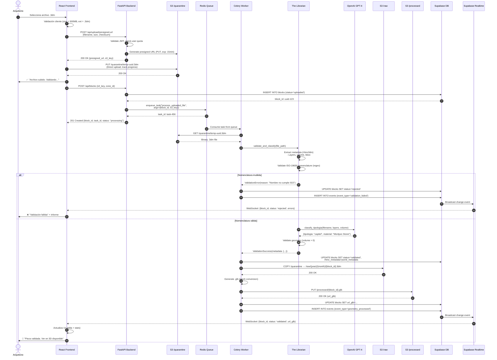
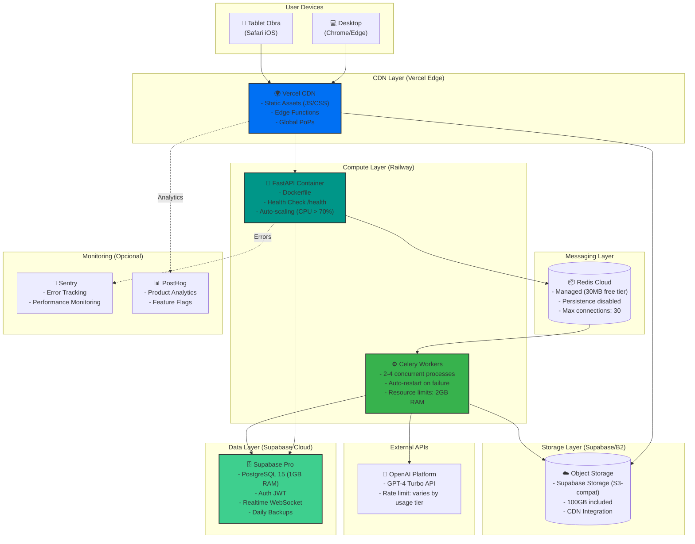

## 🏛️ FASE 6: Arquitectura de Alto Nivel (Diseño de Sistemas)

### Principios Arquitectónicos

SF-PM se diseña como un sistema **Cloud-Native** con enfoque en:

1. **Desacoplamiento:** Componentes independientes comunicados vía eventos/colas para evitar bloqueos.
2. **Escalabilidad Horizontal:** Workers de procesamiento pueden escalar bajo demanda.
3. **Resiliencia:** Manejo de fallos mediante retry policies, dead-letter queues y monitoreo.
4. **Simplicidad Operativa:** Servicios gestionados (Supabase, S3) minimizan carga operacional para un TFM.
5. **Seguridad en Profundidad:** RLS en DB, signed URLs en S3, RBAC en API, autenticación JWT.

**Decisión Arquitectónica Clave:**  
Para archivos de hasta **500MB** (Rhino .3dm), usamos **patrón asíncrono Event-Driven**:  
- Upload directo a S3 (no pasa por API) → Evita timeouts HTTP.  
- Backend encola jobs en Redis → Celery Workers procesan en background.  
- Notificaciones vía WebSockets (Supabase Realtime) → UI actualiza sin polling.

---


### Diagrama de Arquitectura (C4 Container Diagram)

```mermaid
graph TB
    subgraph "Client Layer"
        Browser["🌐 Web Browser<br/>(Chrome/Edge)"]
        ReactApp["⚛️ React SPA<br/>- React 18 + TypeScript<br/>- Three.js (Visor 3D)<br/>- TanStack Query (Cache)<br/>- Zustand (State)"]
    end
    
    subgraph "API Layer (Railway)"
        FastAPI["🚀 FastAPI Backend<br/>- Python 3.11<br/>- JWT Auth Middleware<br/>- Pydantic Validation<br/>- CORS Enabled"]
    end
    
    subgraph "Worker Layer (Railway/Background)"
        Redis[("📦 Redis Queue<br/>(Celery Broker)")]
        CeleryWorkers["⚙️ Celery Workers<br/>- rhino3dm Parser<br/>- Geometry Processor<br/>- .glb Converter"]
        Librarian["🤖 The Librarian Agent<br/>- LangGraph Workflow<br/>- GPT-4 Classification<br/>- ISO-19650 Validator"]
    end
    
    subgraph "Data Layer (Supabase)"
        SupabaseAuth["🔐 Supabase Auth<br/>(JWT Tokens)"]
        SupabaseDB[("🗄️ PostgreSQL<br/>- RLS Policies<br/>- Event Sourcing<br/>- JSONB Metadata")]
        SupabaseRealtime["📡 Supabase Realtime<br/>(WebSocket Server)"]
    end
    
    subgraph "Storage Layer (S3-Compatible)"
        S3Quarantine[("☁️ S3: /quarantine<br/>(Uploads sin validar)")]
        S3Raw[("☁️ S3: /raw<br/>(.3dm validados)")]
        S3Processed[("☁️ S3: /processed<br/>(.glb para visor)")]
    end
    
    subgraph "External Services"
        OpenAI["🧠 OpenAI API<br/>(GPT-4 Turbo)"]
    end
    
    %% Flujo de Usuario
    Browser -->|HTTPS| ReactApp
    ReactApp -->|REST API| FastAPI
    ReactApp -->|WebSocket| SupabaseRealtime
    
    %% Autenticación
    FastAPI -->|Validate JWT| SupabaseAuth
    ReactApp -->|Login/Signup| SupabaseAuth
    
    %% Flujo de Upload (Presigned URL)
    FastAPI -->|Generate Presigned URL| S3Quarantine
    ReactApp -->|Direct Upload (PUT)| S3Quarantine
    
    %% Procesamiento Asíncrono
    FastAPI -->|Enqueue Job| Redis
    Redis -->|Consume Tasks| CeleryWorkers
    CeleryWorkers -->|Extract Metadata| Librarian
    Librarian -->|LLM Classification| OpenAI
    
    %% Persistencia
    FastAPI -->|CRUD Operations| SupabaseDB
    CeleryWorkers -->|Update Status| SupabaseDB
    Librarian -->|Insert Events| SupabaseDB
    
    %% Almacenamiento
    CeleryWorkers -->|Move .3dm| S3Raw
    CeleryWorkers -->|Upload .glb| S3Processed
    
    %% Notificaciones
    SupabaseDB -->|Change Event| SupabaseRealtime
    SupabaseRealtime -->|Broadcast| ReactApp
    
    %% Visualización
    ReactApp -->|Fetch .glb| S3Processed
    
    style ReactApp fill:#61dafb,stroke:#333,stroke-width:2px
    style FastAPI fill:#009688,stroke:#333,stroke-width:2px
    style Librarian fill:#ff6b6b,stroke:#333,stroke-width:3px
    style SupabaseDB fill:#3ecf8e,stroke:#333,stroke-width:2px
    style CeleryWorkers fill:#37b24d,stroke:#333,stroke-width:2px
```

---

### Definición de Componentes (Responsabilidades)

#### 1. **Client Layer: React SPA**

**Responsabilidad:** Interfaz de usuario interactiva con capacidades 3D.

**Tecnologías:**
- **React 18:** UI componentes, hooks, context API
- **Three.js + React-Three-Fiber:** Renderizado WebGL de geometría .glb
- **TanStack Query (React Query):** Cache de datos, sincronización servidor-cliente
- **Zustand:** Estado global ligero (usuario autenticado, filtros)
- **Tailwind CSS:** Estilos utility-first
- **Vite:** Bundler con HMR rápido

**Comunicación:**
- REST API con FastAPI (fetch via TanStack Query)
- WebSocket con Supabase Realtime (notificaciones push)
- Upload directo a S3 vía Presigned URLs (XMLHttpRequest con progress tracking)

**Deploy:** Vercel (CDN global, edge functions, auto-scaling)

---

#### 2. **API Layer: FastAPI Backend**

**Responsabilidad:** Orquestador de lógica de negocio, validación, autenticación y encolado de jobs.

**Tecnologías:**
- **FastAPI 0.109+:** Framework async con OpenAPI auto-generado
- **Pydantic 2.x:** Validación de schemas, serialización
- **python-jose:** Manejo de JWT tokens
- **httpx:** Cliente HTTP async para Supabase REST API

**Endpoints Críticos:**
```python
POST /api/upload/presigned-url     # Genera URL firmada S3
POST /api/blocks                   # Crea registro en DB + encola job
GET  /api/blocks                   # Lista con filtros (status, zone)
PATCH /api/blocks/{id}/status      # Actualiza estado + log evento
GET  /api/dashboard                # Agregaciones para stats
POST /api/auth/login               # Proxy a Supabase Auth
```

**Middlewares:**
- CORS (allow origins: frontend domain)
- JWT Authentication (verify token con Supabase public key)
- Rate Limiting (100 req/min por IP)
- Request Logging (structured JSON logs)

**Deploy:** Railway (Procfile: `uvicorn main:app --host 0.0.0.0 --port $PORT`)

---

#### 3. **Worker Layer: Celery + The Librarian**

**Responsabilidad:** Procesamiento pesado en background (extracción metadata, validación, conversión 3D).

**Componentes:**

##### **3.1. Celery Workers**
- **Broker:** Redis (cola de mensajes)
- **Backend:** Redis (almacenamiento de resultados)
- **Workers:** 2-4 procesos concurrentes (configuración inicial)

**Tasks Principales:**
```python
@celery.task
def process_uploaded_file(block_id: str, s3_key: str):
    # 1. Download .3dm desde S3
    # 2. Llama a The Librarian para validación
    # 3. Si OK: Extrae metadata + genera .glb
    # 4. Upload .glb a S3 /processed
    # 5. UPDATE blocks SET url_glb=... WHERE id=block_id
    pass

@celery.task
def extract_metadata(file_path: str) -> dict:
    # rhino3dm.File3dm.Read()
    # Extrae: volume, weight, bbox, layers
    pass

@celery.task
def generate_glb(rhino_file: str, output_path: str):
    # Convierte geometría Rhino → .glb
    # Mesh decimation para optimizar peso
    pass
```

##### **3.2. The Librarian Agent (LangGraph)**
- **Framework:** LangGraph (stateful workflows)
- **LLM:** OpenAI GPT-4 Turbo (clasificación semántica)

**Workflow States:**
```python
class LibrarianWorkflow:
    states = [
        "validate_nomenclature",   # Regex ISO-19650
        "classify_tipologia",      # LLM: capitel, columna, dovela...
        "validate_geometry",       # Volume > 0, closed mesh
        "enrich_metadata",         # LLM: Material, construction phase
        "generate_report"          # ValidationResult(ok=True/False)
    ]
```

**Comunicación con LLM:**
```python
from langchain_openai import ChatOpenAI
from langgraph.graph import StateGraph

llm = ChatOpenAI(model="gpt-4-turbo", temperature=0)

prompt = f"""
Clasifica esta pieza arquitectónica:
Nombre: {filename}
Layers: {layers}
Volumen: {volume} m³

Devuelve JSON: {{"tipologia": "capitel|columna|dovela|clave|imposta", "material": "..."}}
"""

response = llm.invoke(prompt)
```

**Deploy:** Mismo contenedor que Celery Workers (Railway)

---

#### 4. **Data Layer: Supabase (Managed Services)**

**Responsabilidad:** Almacenamiento persistente, autenticación y notificaciones en tiempo real.

**Componentes:**

##### **4.1. Supabase Auth**
- **JWT-based:** Tokens con claims (user_id, role, exp)
- **Providers:** Email/Password (principal), Google OAuth (futuro)
- **RLS Integration:** `auth.uid()` disponible en políticas PostgreSQL

##### **4.2. PostgreSQL Database**
- **Versión:** PostgreSQL 15+ (managed)
- **Extensions:** pgcrypto (UUIDs), pg_stat_statements (monitoring)
- **Esquema:** 8 tablas (ver FASE 5)
- **Backups:** Automáticos diarios (retention 7 días)

##### **4.3. Supabase Realtime**
- **Protocolo:** WebSocket (Phoenix Channels)
- **Subscriptions:** Clientes escuchan cambios en tablas específicas

**Ejemplo de Suscripción:**
```typescript
const subscription = supabase
  .channel('blocks-changes')
  .on('postgres_changes', {
    event: 'UPDATE',
    schema: 'public',
    table: 'blocks',
    filter: `status=eq.in_fabrication`
  }, (payload) => {
    console.log('Pieza actualizada:', payload.new)
    // Actualiza UI sin refetch
  })
  .subscribe()
```

**Deploy:** Supabase Cloud (tier Pro: $25/mes)

---

#### 5. **Storage Layer: S3-Compatible Buckets**

**Responsabilidad:** Almacenamiento de archivos CAD originales y geometría procesada.

**Estructura de Buckets:**

```text
sf-pm-storage/
├── quarantine/        # Uploads sin validar (lifecycle: 7 días)
│   └── temp-{uuid}.3dm
├── raw/               # Archivos .3dm validados (long-term)
│   └── {year}/{month}/{block_id}.3dm
└── processed/         # Geometría .glb para visor (CDN)
    └── {block_id}.glb
```

**Políticas de Lifecycle:**
- `/quarantine`: Auto-delete después de 7 días si no se movió a `/raw`
- `/raw`: Retention indefinido (archival)
- `/processed`: CDN caching (CloudFlare/CloudFront)

**Seguridad:**
- **Presigned URLs:** Escritura temporal (15 min expiry)
- **IAM Policies:** Backend tiene read/write, frontend solo via presigned URLs
- **CORS:** Allow origins: frontend domain

**Provider:** Supabase Storage (S3-compatible) o Backblaze B2 (más económico)

---

#### 6. **External Services**

##### **6.1. OpenAI API (GPT-4)**
- **Uso:** Clasificación semántica de piezas, enriquecimiento de metadatos
- **Modelo:** `gpt-4-turbo` (128k context, JSON mode)
- **Rate Limits:** Depende del Tier de la cuenta (Tier 1 ~30k TPM hasta Tier 5 ~2M TPM).
- **Costo Estimado:** Variable según consumo real de tokens (input/output). Estimación inicial ~$200/mes para volumen medio.

**Fallback Strategy:**  
Si API falla o excede presupuesto → Regex-based classification (menos preciso pero funcional)

---

### Patrones Arquitectónicos Aplicados

#### 1. **Event-Driven Architecture (Async Processing)**

**Problema:** Archivos de 500MB tardan minutos en procesarse. Respuesta HTTP síncrona causaría timeouts.

**Solución:**  
- Usuario recibe confirmación inmediata tras upload a S3.
- Processing job se encola en Redis (Celery).
- Worker procesa en background.
- UI recibe notificación vía WebSocket cuando termina.

**Ventajas:**
- ✅ UI nunca bloqueada
- ✅ Workers escalan horizontalmente bajo carga
- ✅ Retry automático en fallos transitorios

---

#### 2. **Presigned URLs (Direct Upload)**

**Problema:** Upload de 500MB a través de API consume recursos del servidor.

**Solución:**  
Backend genera URL firmada S3 con permisos temporales (PUT). Frontend sube directamente a S3.

**Flujo:**
```text
1. Frontend: POST /api/upload/presigned-url {filename, size}
2. Backend: Valida, genera URL firmada (expira en 15 min)
3. Frontend: PUT https://s3.../quarantine/uuid.3dm (XMLHttpRequest con progress)
4. S3: Responde 200 OK
5. Frontend: POST /api/blocks {s3_key} → Backend encola job
```

**Ventajas:**
- ✅ Menor carga en servidor API
- ✅ Uploads paralelos (múltiples archivos simultáneos)
- ✅ Progress tracking nativo del navegador

---

#### 3. **Event Sourcing (Immutable Audit Log)**

**Problema:** Necesidad de trazabilidad completa (quién cambió qué y cuándo).

**Solución:**  
Tabla `events` append-only. Cada cambio genera un evento inmutable.

**Implementación:**
```sql
-- Trigger automático en UPDATE de blocks
CREATE TRIGGER log_status_change
AFTER UPDATE ON blocks
FOR EACH ROW
WHEN (OLD.status IS DISTINCT FROM NEW.status)
EXECUTE FUNCTION insert_status_event();
```

**Ventajas:**
- ✅ Reconstrucción de historial completo
- ✅ Compliance patrimonial garantizado
- ✅ Debugging de incidencias (timeline completo)

---

#### 4. **CQRS Ligero (Read/Write Separation)**

**Problema:** Dashboard requiere agregaciones pesadas (COUNT, GROUP BY). Estas queries impactan performance de escrituras.

**Solución:**  
Endpoint `/api/dashboard` usa queries optimizadas con índices específicos. Futuro: Materialized Views.

**Ejemplo:**
```sql
-- Query optimizada con índices
SELECT status, COUNT(*) as count
FROM blocks
WHERE is_archived = false
GROUP BY status;

-- Usa índice: idx_blocks_status
```

---

### Flujo Crítico: Ingesta de Archivo (Detallado)

**Escenario:** Arquitecto sube archivo `SF-C12-D-001.3dm` (150MB) con 200 piezas.



**Tiempos Estimados:**
- Paso 1-6 (Upload directo S3): **30-60 segundos** (150MB @ 20 Mbps)
- Paso 7-12 (Encolado + confirmación): **< 1 segundo**
- Paso 13-25 (Processing background): **2-5 minutos** (depende de complejidad geometría)
- **Total percibido por usuario:** 1 min (upload) + notificación async cuando termine

---

### Diagrama de Deployment (Infraestructura)



**Costos Mensuales Estimados (MVP):**

| Servicio | Tier | Costo/Mes |
|----------|------|----------|
| **Vercel** (Frontend) | Hobby (1 proyecto) | $0 |
| **Railway** (Backend + Workers) | Starter (512MB RAM × 2 services) | $10 |
| **Supabase** | Pro (1GB DB, 100GB storage) | $25 |
| **Redis Cloud** | Free (30MB) | $0 |
| **OpenAI API** | Pay-as-you-go (10k requests) | $200 |
| **Sentry** | Developer (5k events) | $0 |
| **TOTAL** | | **$235/mes** |

**Escalabilidad Post-MVP:**
- Railway → $20/mes (1GB RAM workers)
- Supabase → $100/mes (4GB DB, 500GB storage)
- OpenAI → $500/mes (50k requests)
- **Total producción:** ~$650/mes

---

### Decisiones Técnicas Clave

#### 1. **¿Por qué Celery en lugar de AWS Lambda/Cloud Functions?**

**Razones:**
- ✅ **Archivos pesados:** Lambda tiene límite de 6 MB payload. Archivos Rhino son hasta 500MB.
- ✅ **Timeouts:** Lambda max 15 min. Procesamiento puede tardar más.
- ✅ **Dependencias nativas:** rhino3dm requiere librerías C++ compiladas. Más simple en contenedor.
- ✅ **Costo:** Celery workers en Railway ($10/mes) vs Lambda ($200+/mes con procesamiento intensivo).

#### 2. **¿Por qué Supabase en lugar de PostgreSQL auto-gestionado?**

**Razones:**
- ✅ **Auth integrado:** JWT tokens, RLS, OAuth providers out-of-the-box.
- ✅ **Realtime incluido:** WebSocket server sin configuración.
- ✅ **Backups automáticos:** Point-in-time recovery sin overhead operacional.
- ✅ **Dashboard:** SQL Editor, logs, métricas incluidas.
- ✅ **Tiempo de desarrollo:** Ahorra 2-3 semanas de setup para un TFM.

#### 3. **¿Por qué LangGraph en lugar de LangChain clásico?**

**Razones:**
- ✅ **Stateful workflows:** Validación multi-paso con estados persistentes.
- ✅ **Debugging:** Visualización del grafo de estados (útil para TFM).
- ✅ **Error handling:** Retry policies por nodo del grafo.
- ✅ **Human-in-the-loop:** Posibilidad futura de aprobación manual en casos ambiguos.

#### 4. **¿Por qué React en lugar de Next.js?**

**Razones:**
- ✅ **SPA pura:** No necesitamos SSR (dashboard interno, no SEO crítico).
- ✅ **Simplicidad:** Vite es más rápido y simple que Next.js para este caso.
- ✅ **Three.js:** Mejor integración con React-Three-Fiber en SPA.
- ❌ **Trade-off:** Perdemos SSR/ISR, pero no es relevante para herramienta interna.

---

### Estrategia de Resiliencia y Manejo de Errores

#### 1. **Retry Policies (Celery)**

```python
@celery.task(bind=True, max_retries=3, default_retry_delay=60)
def process_uploaded_file(self, block_id: str, s3_key: str):
    try:
        # Procesamiento
        pass
    except TransientError as exc:
        # Errores temporales (red, S3 timeout) → Retry
        raise self.retry(exc=exc, countdown=60)
    except PermanentError as exc:
        # Errores permanentes (geometría corrupta) → Marcar como rejected
        update_block_status(block_id, status="rejected", error=str(exc))
```

#### 2. **Circuit Breaker (OpenAI API)**

```python
from circuitbreaker import circuit

@circuit(failure_threshold=5, recovery_timeout=60)
def classify_with_llm(prompt: str) -> dict:
    response = openai.ChatCompletion.create(
        model="gpt-4-turbo",
        messages=[{"role": "user", "content": prompt}]
    )
    return response.choices[0].message.content

# Si falla 5 veces → Circuit OPEN (usa fallback regex por 60s)
```

#### 3. **Dead Letter Queue (DLQ)**

```python
# Configuración Celery
CELERY_TASK_ROUTES = {
    'process_uploaded_file': {
        'queue': 'processing',
        'routing_key': 'processing',
    },
}

CELERY_TASK_REJECT_ON_WORKER_LOST = True
CELERY_TASK_ACKS_LATE = True  # Acknowledge después de completar

# Si task falla 3 veces → DLQ (revisar manualmente)
```

#### 4. **Health Checks**

```python
# FastAPI
@app.get("/health")
async def health_check():
    checks = {
        "api": "ok",
        "database": await check_db_connection(),
        "redis": await check_redis_connection(),
        "s3": await check_s3_access(),
    }
    
    status = 200 if all(v == "ok" for v in checks.values()) else 503
    return JSONResponse(content=checks, status_code=status)

# Railway health check: curl http://app:8000/health cada 30s
```

---

### Seguridad (Defense in Depth)

#### Capa 1: Frontend
- ✅ CSP Headers (Content-Security-Policy)
- ✅ Input sanitization (evitar XSS)
- ✅ JWT stored en memory (no localStorage para máxima seguridad)
- ✅ HTTPS only (enforced por Vercel)

#### Capa 2: API
- ✅ Rate limiting (100 req/min por IP)
- ✅ JWT validation (verificar signature + expiry)
- ✅ CORS strict (solo frontend domain)
- ✅ Pydantic schemas (validación exhaustiva de inputs)

#### Capa 3: Database
- ✅ RLS policies (acceso a nivel de fila por rol)
- ✅ Prepared statements (prevenir SQL injection)
- ✅ Encryption at rest (Supabase default)

#### Capa 4: Storage
- ✅ Presigned URLs con expiry corto (15 min)
- ✅ IAM roles (backend tiene permisos mínimos)
- ✅ Virus scanning (futuro: S3 Object Lambda con ClamAV)

---


