## FASE 7: Diseño en Profundidad - Agente "The Librarian" (C4 Level 3)

**Objetivo:** Desglosar la arquitectura interna del **Agente de Validación Activa** que procesa archivos .3dm con robustez industrial, sin "alucinaciones" LLM, usando orquestación con LangGraph.

---

### Visión General del Agente

**The Librarian** es un **agente stateful** que valida archivos CAD en múltiples capas (sintaxis, geometría, semántica) combinando:
- **Reglas deterministas** (Regex ISO-19650, validaciones geométricas)
- **Inteligencia artificial** (GPT-4 para clasificación semántica)
- **Orquestación de flujo** (LangGraph state machine)

**Principios de Diseño:**
1. **Fail-Fast:** Detener validación en el primer error crítico para ahorrar recursos.
2. **Fallback Graceful:** Si LLM falla, usar clasificación regex básica.
3. **Idempotencia:** Re-ejecutar con mismo input produce mismo output.
4. **Audit Trail:** Cada paso genera evento en `events` table.

---

### Componentes Internos (C4 Level 3)

#### Tabla de Responsabilidades

| Componente | Responsabilidad | Tecnología | Input | Output |
|------------|----------------|------------|-------|--------|
| **1. State Manager** | Orquestación del flujo de validación (state machine) | LangGraph StateGraph | ValidationRequest | ValidationReport |
| **2. Syntax Validator** | Validación nomenclatura ISO-19650 | Python Regex | filename: str | NomenclatureResult |
| **3. Geometry Extractor** | Parseo del archivo .3dm y extracción de metadata | rhino3dm library | file_path: str | GeometryMetadata |
| **4. Geometry Validator** | Validaciones topológicas (volume > 0, closed mesh) | Custom Python + rhino3dm | GeometryMetadata | GeometryValidation |
| **5. Semantic Validator** | Clasificación tipología y enriquecimiento vía LLM | OpenAI GPT-4 (LangChain) | GeometryMetadata | SemanticData |
| **6. Report Generator** | Compilación de resultados en formato JSON/PDF | Jinja2 templates | ValidationState | ValidationReport |
| **7. Error Handler** | Retry logic, circuit breaker, fallback strategies | Tenacity + Circuit Breaker | Exception | RetryDecision |

---

### Diagrama C4 Component (Arquitectura Interna)


---

### Grafo de Estado LangGraph (State Machine)

**Definición del State:**
```python
from typing import TypedDict, Literal

class ValidationState(TypedDict):
    block_id: str
    file_path: str
    filename: str
    
    # Resultados de validación
    nomenclature_valid: bool
    nomenclature_errors: list[str]
    
    geometry_metadata: dict  # {volume, weight, bbox, layers}
    geometry_valid: bool
    geometry_errors: list[str]
    
    semantic_data: dict  # {tipologia, material, construction_phase}
    semantic_valid: bool
    semantic_errors: list[str]
    
    # Estado final
    overall_status: Literal["validated", "rejected"]
    report: dict
```

**Diagrama de Estados:**

```mermaid
stateDiagram-v2
    [*] --> START
    
    START --> ValidateNomenclature: Trigger validation
    
    ValidateNomenclature --> ExtractGeometry: ✅ Nomenclature OK
    ValidateNomenclature --> REJECTED: ❌ Invalid ISO-19650
    
    ExtractGeometry --> ValidateGeometry: ✅ Extraction OK
    ExtractGeometry --> REJECTED: ❌ File corrupt/unreadable
    
    ValidateGeometry --> ClassifyTipologia: ✅ Geometry valid
    ValidateGeometry --> REJECTED: ❌ Volume=0 or open mesh
    
    ClassifyTipologia --> EnrichMetadata: ✅ LLM classification OK
    ClassifyTipologia --> FallbackClassification: ❌ LLM failed/timeout
    
    FallbackClassification --> EnrichMetadata: Use regex-based classification
    
    EnrichMetadata --> GenerateReport: ✅ Semantic data enriched
    EnrichMetadata --> REJECTED: ❌ Anomalies detected
    
    GenerateReport --> CommitToDB: Compile validation report
    CommitToDB --> MoveToRaw: Update blocks table
    MoveToRaw --> GenerateGLB: Copy .3dm to /raw/
    GenerateGLB --> VALIDATED: Upload .glb to /processed/
    
    REJECTED --> [*]: Insert rejection event
    VALIDATED --> [*]: Insert validation event
    
    note right of ClassifyTipologia
        Circuit Breaker:
        Si OpenAI falla 5 veces
        → Fallback automático
    end note
    
    note right of REJECTED
        Fail-Fast:
        Stop en primer error crítico
        No consume recursos LLM
    end note
```



---

### Definición de Nodos LangGraph (Implementación)

#### Nodo 1: `validate_nomenclature`

**Responsabilidad:** Validar que el filename cumple ISO-19650.

**Implementación:**
```python
import re
from langgraph.graph import StateGraph

def validate_nomenclature(state: ValidationState) -> ValidationState:
    """
    Pattern: SF-{ZONE}-{TYPE}-{ID}
    - ZONE: C01-C12, F01-F05 (columnas/fachadas)
    - TYPE: D (dovela), C (capitel), I (imposta)
    - ID: 001-999
    """
    pattern = r'^SF-[CF]\d{2}-[DCI]-\d{3}\.3dm$'
    
    if re.match(pattern, state["filename"]):
        state["nomenclature_valid"] = True
        state["nomenclature_errors"] = []
    else:
        state["nomenclature_valid"] = False
        state["nomenclature_errors"] = [
            f"Filename '{state['filename']}' no cumple ISO-19650",
            f"Formato esperado: SF-[ZONE]-[TYPE]-[ID].3dm"
        ]
        state["overall_status"] = "rejected"
    
    return state
```

---

#### Nodo 2: `extract_geometry`

**Responsabilidad:** Abrir el archivo .3dm y extraer metadatos geométricos.

**Implementación:**
```python
import rhino3dm

def extract_geometry(state: ValidationState) -> ValidationState:
    """
    Usa rhino3dm para parsear el archivo sin Rhino instalado.
    """
    try:
        file = rhino3dm.File3dm.Read(state["file_path"])
        
        # Extrae objetos 3D y convierte a Brep para análisis
        objects = []
        for obj in file.Objects:
            geometry = obj.Geometry
            if isinstance(geometry, rhino3dm.Brep):
                objects.append(geometry)
            elif hasattr(geometry, 'ToBrep'):
                 # Intentar convertir (ej. Extrusion a Brep)
                 brep = geometry.ToBrep()
                 if brep: objects.append(brep)
        
        # Calcula volumen total (solo para Breps válidos)
        total_volume = 0
        for brep in objects:
            if brep.IsSolid:
                total_volume += brep.GetVolume()
        
        # Extrae layers
        layers = [layer.Name for layer in file.Layers]
        
        # BoundingBox
        bbox = file.BoundingBox() if hasattr(file, 'BoundingBox') else None
        
        state["geometry_metadata"] = {
            "volume_m3": total_volume,
            "weight_kg": total_volume * 2400,  # Densidad piedra Montjuïc
            "layers": layers,
            "object_count": len(objects),
            "bbox": str(bbox) if bbox else None
        }
        
        state["geometry_valid"] = True  # Asume válido por ahora
        
    except Exception as e:
        state["geometry_valid"] = False
        state["geometry_errors"] = [f"Error al parsear archivo: {str(e)}"]
        state["overall_status"] = "rejected"
    
    return state
```

---

#### Nodo 3: `validate_geometry`

**Responsabilidad:** Comprobaciones topológicas (volumen > 0, mesh cerrado).

**Implementación:**
```python
def validate_geometry(state: ValidationState) -> ValidationState:
    """
    Validaciones:
    - Volumen > 0 (no geometría vacía)
    - Peso razonable (0.5 ton - 10 ton para piezas arquitectónicas)
    """
    metadata = state["geometry_metadata"]
    errors = []
    
    # Check 1: Volume
    if metadata["volume_m3"] <= 0:
        errors.append("Volumen es 0 o negativo (geometría inválida)")
    
    # Check 2: Peso razonable
    if metadata["weight_kg"] < 500 or metadata["weight_kg"] > 10000:
        errors.append(f"Peso estimado {metadata['weight_kg']}kg fuera de rango (500-10000kg)")
    
    # Check 3: Al menos un objeto
    if metadata["object_count"] == 0:
        errors.append("Archivo no contiene geometría 3D")
    
    if errors:
        state["geometry_valid"] = False
        state["geometry_errors"] = errors
        state["overall_status"] = "rejected"
    else:
        state["geometry_valid"] = True
        state["geometry_errors"] = []
    
    return state
```

---

#### Nodo 4: `classify_tipologia` (LLM)

**Responsabilidad:** Clasificar la pieza usando GPT-4 (capitel, dovela, clave...).

**Implementación:**
```python
from langchain_openai import ChatOpenAI
from langchain.prompts import ChatPromptTemplate
import json

llm = ChatOpenAI(model="gpt-4-turbo", temperature=0)

def classify_tipologia(state: ValidationState) -> ValidationState:
    """
    Usa GPT-4 con JSON Mode para clasificación estructurada.
    """
    metadata = state["geometry_metadata"]
    filename = state["filename"]
    
    prompt = ChatPromptTemplate.from_messages([
        ("system", """Eres un experto en arquitectura gótica de la Sagrada Familia.
Clasifica piezas arquitectónicas basándote en:
- Nomenclatura del archivo
- Volumen y peso
- Layers del modelo CAD

Tipologías válidas: capitel, columna, dovela, clave, imposta, contrafuerte.
Devuelve JSON: {{"tipologia": "...", "material": "...", "confidence": 0.0-1.0}}"""),
        ("user", f"""
Archivo: {filename}
Volumen: {metadata['volume_m3']:.2f} m³
Peso estimado: {metadata['weight_kg']:.0f} kg
Layers: {', '.join(metadata['layers'])}

Clasifica esta pieza.""")
    ])
    
    try:
        response = llm.invoke(prompt.format_messages())
        classification = json.loads(response.content)
        
        state["semantic_data"] = classification
        state["semantic_valid"] = True
        
        # Log evento de clasificación
        # (insertar en events table vía API call)
        
    except Exception as e:
        # Si LLM falla, trigger fallback
        state.setdefault("semantic_errors", []).append(f"LLM classification failed: {str(e)}")
        state["semantic_valid"] = False
    
    return state
```

---

#### Nodo 5: `fallback_classification`

**Responsabilidad:** Clasificación regex si LLM falla.

**Implementación:**
```python
def fallback_classification(state: ValidationState) -> ValidationState:
    """
    Clasificación básica usando regex sobre filename.
    Menos preciso que LLM pero garantiza progreso.
    """
    filename = state["filename"]
    
    # Regex patterns
    if re.search(r'-D-', filename):
        tipologia = "dovela"
    elif re.search(r'-C-', filename):
        tipologia = "capitel"
    elif re.search(r'-I-', filename):
        tipologia = "imposta"
    else:
        tipologia = "unknown"
    
    state["semantic_data"] = {
        "tipologia": tipologia,
        "material": "Piedra Montjuïc (inferido)",
        "confidence": 0.6,
        "method": "fallback_regex"
    }
    
    state["semantic_valid"] = True
    state["semantic_errors"].append("LLM unavailable, used regex fallback")
    
    return state
```

---

#### Nodo 6: `generate_report`

**Responsabilidad:** Compilar todos los resultados en un report estructurado.

**Implementación:**
```python
from datetime import datetime

def generate_report(state: ValidationState) -> ValidationState:
    """
    Genera informe JSON con todos los checks realizados.
    """
    report = {
        "block_id": state["block_id"],
        "timestamp": datetime.utcnow().isoformat(),
        "status": state["overall_status"],
        
        "validations": {
            "nomenclature": {
                "passed": state["nomenclature_valid"],
                "errors": state["nomenclature_errors"]
            },
            "geometry": {
                "passed": state["geometry_valid"],
                "errors": state["geometry_errors"],
                "metadata": state["geometry_metadata"]
            },
            "semantic": {
                "passed": state["semantic_valid"],
                "errors": state["semantic_errors"],
                "data": state["semantic_data"]
            }
        },
        
        "summary": {
            "total_checks": 3,
            "passed_checks": sum([
                state["nomenclature_valid"],
                state["geometry_valid"],
                state["semantic_valid"]
            ]),
            "recommendation": "APPROVED" if state["overall_status"] == "validated" else "REJECTED"
        }
    }
    
    state["report"] = report
    return state
```

---

### Definición del Grafo LangGraph (Wiring)

**Construcción del StateGraph:**

```python
from langgraph.graph import StateGraph, END

# Inicializa el grafo
workflow = StateGraph(ValidationState)

# Añade nodos
workflow.add_node("validate_nomenclature", validate_nomenclature)
workflow.add_node("extract_geometry", extract_geometry)
workflow.add_node("validate_geometry", validate_geometry)
workflow.add_node("classify_tipologia", classify_tipologia)
workflow.add_node("fallback_classification", fallback_classification)
workflow.add_node("generate_report", generate_report)

# Define edges (flujo)
workflow.set_entry_point("validate_nomenclature")

workflow.add_conditional_edges(
    "validate_nomenclature",
    lambda state: "continue" if state["nomenclature_valid"] else "reject",
    {
        "continue": "extract_geometry",
        "reject": "generate_report"
    }
)

workflow.add_conditional_edges(
    "extract_geometry",
    lambda state: "continue" if state["geometry_valid"] else "reject",
    {
        "continue": "validate_geometry",
        "reject": "generate_report"
    }
)

workflow.add_conditional_edges(
    "validate_geometry",
    lambda state: "continue" if state["geometry_valid"] else "reject",
    {
        "continue": "classify_tipologia",
        "reject": "generate_report"
    }
)

workflow.add_conditional_edges(
    "classify_tipologia",
    lambda state: "continue" if state["semantic_valid"] else "fallback",
    {
        "continue": "generate_report",
        "fallback": "fallback_classification"
    }
)

workflow.add_edge("fallback_classification", "generate_report")
workflow.add_edge("generate_report", END)

# Compila el grafo
app = workflow.compile()
```

---

### Ejemplo de Ejecución (Invocación desde Celery)

**Task de Celery que llama al agente:**

```python
from celery import shared_task
from librarian_agent import app as librarian_app

@shared_task
def process_uploaded_file(block_id: str, s3_key: str):
    # 1. Download archivo desde S3
    file_path = download_from_s3(s3_key)
    
    # 2. Inicializa estado
    initial_state = {
        "block_id": block_id,
        "file_path": file_path,
        "filename": s3_key.split("/")[-1],
        "nomenclature_valid": False,
        "nomenclature_errors": [],
        "geometry_metadata": {},
        "geometry_valid": False,
        "geometry_errors": [],
        "semantic_data": {},
        "semantic_valid": False,
        "semantic_errors": [],
        "overall_status": "pending"
    }
    
    # 3. Ejecuta el agente LangGraph
    final_state = librarian_app.invoke(initial_state)
    
    # 4. Actualiza DB con resultados
    update_block_status(
        block_id=block_id,
        status=final_state["overall_status"],
        rhino_metadata=final_state["geometry_metadata"],
        validation_report=final_state["report"]
    )
    
    # 5. Si validado, mueve archivo a /raw/
    if final_state["overall_status"] == "validated":
        move_to_raw(s3_key)
        generate_glb(file_path, block_id)
    
    return final_state["report"]
```

---

### Manejo de Errores y Resiliencia

#### Circuit Breaker para OpenAI API

```python
from circuitbreaker import circuit

@circuit(failure_threshold=5, recovery_timeout=60, expected_exception=(APIError, TimeoutError))
def call_openai_api(prompt: str) -> dict:
    """
    Circuit Breaker: Si falla 5 veces consecutivas, abre circuito por 60s.
    Durante ese tiempo, todas las llamadas fallan rápido sin intentar.
    """
    response = llm.invoke(prompt)
    return json.loads(response.content)

# Uso en classify_tipologia
try:
    classification = call_openai_api(prompt)
except CircuitBreakerError:
    # Circuito abierto → usar fallback inmediatamente
    return fallback_classification(state)
```

#### Retry con Backoff Exponencial

```python
from tenacity import retry, stop_after_attempt, wait_exponential

@retry(
    stop=stop_after_attempt(3),
    wait=wait_exponential(multiplier=1, min=2, max=10)
)
def extract_geometry_with_retry(file_path: str) -> dict:
    """
    Reintenta hasta 3 veces con backoff exponencial (2s, 4s, 8s).
    Útil para errores transitorios (S3 download timeout).
    """
    return rhino3dm.File3dm.Read(file_path)
```

---

### Métricas y Observabilidad

**Logs Estructurados (JSON):**

```python
import logging
import json

logger = logging.getLogger("librarian_agent")

def log_validation_event(state: ValidationState, node: str, result: str):
    log_entry = {
        "timestamp": datetime.utcnow().isoformat(),
        "block_id": state["block_id"],
        "node": node,
        "result": result,
        "errors": state.get(f"{node}_errors", [])
    }
    logger.info(json.dumps(log_entry))

# Uso en cada nodo
def validate_nomenclature(state: ValidationState) -> ValidationState:
    # ... lógica de validación ...
    
    log_validation_event(
        state, 
        "nomenclature", 
        "passed" if state["nomenclature_valid"] else "failed"
    )
    
    return state
```

**Dashboards:**
- **Sentry:** Tracking de excepciones no manejadas
- **PostHog:** Métricas de % validación exitosa, tiempo promedio por nodo
- **Custom:** Tabla `agent_metrics` en Supabase con:
  - `node_execution_time_ms`
  - `llm_tokens_used`
  - `fallback_rate` (% de veces que usa regex vs LLM)

---

### Decisiones de Diseño Clave

#### 1. **¿Por qué LangGraph en lugar de Celery Chains?**

**Razones:**
- ✅ **Stateful:** Mantiene estado entre nodos (Celery chains son stateless).
- ✅ **Conditional edges:** Flujo dinámico basado en resultados previos.
- ✅ **Debugging:** Visualización del grafo, replay de estados.
- ✅ **Human-in-the-loop:** Futuro: pausar en nodo "classify_tipologia" para aprobación manual.

#### 2. **¿Por qué JSON Mode en GPT-4?**

**Razones:**
- ✅ **Structured output:** Garantiza respuesta parseable (no texto libre).
- ✅ **Type safety:** Pydantic valida el JSON response.
- ✅ **No post-processing:** Evita regex para extraer datos de texto natural.

#### 3. **¿Por qué Fallback Regex en lugar de fallar?**

**Razones:**
- ✅ **Resiliencia:** 95% de archivos pueden clasificarse con regex básico.
- ✅ **Cost control:** Si OpenAI API tiene downtime, sistema sigue operativo.
- ✅ **SLA:** Garantiza procesamiento aunque sea con menor precisión.

---

### Testing del Agente

**Test Cases Unitarios:**

```python
import pytest

def test_validate_nomenclature_valid():
    state = {
        "filename": "SF-C12-D-001.3dm",
        "nomenclature_valid": False
    }
    
    result = validate_nomenclature(state)
    
    assert result["nomenclature_valid"] == True
    assert result["nomenclature_errors"] == []

def test_validate_nomenclature_invalid():
    state = {
        "filename": "invalid_name.3dm",
        "nomenclature_valid": False
    }
    
    result = validate_nomenclature(state)
    
    assert result["nomenclature_valid"] == False
    assert len(result["nomenclature_errors"]) > 0
    assert result["overall_status"] == "rejected"
```

**Test de Integración (Grafo Completo):**

```python
def test_full_workflow_valid_file():
    initial_state = {
        "block_id": "test-123",
        "file_path": "/tmp/SF-C12-D-001.3dm",
        "filename": "SF-C12-D-001.3dm"
    }
    
    final_state = librarian_app.invoke(initial_state)
    
    assert final_state["overall_status"] == "validated"
    assert final_state["semantic_data"]["tipologia"] == "dovela"
    assert "report" in final_state
```


---


### Test Environment Setup

**Mocking External Services:**

To ensure deterministic tests and avoid costs, use the following mocking strategy:

1.  **S3 Storage**: Use `moto` library to mock S3 buckets and objects in memory.
2.  **OpenAI API**: Use `pytest-mock` to mock `openai.ChatCompletion.create` responses.
    ```python
    def test_classify_tipologia_mock(mocker):
        mock_response = mocker.Mock()
        mock_response.choices[0].message.content = '{"tipologia": "capitel", ...}'
        mocker.patch("openai.ChatCompletion.create", return_value=mock_response)
        # ... run test ...
    ```
3.  **Supabase Auth**: Mock `auth.uid()` and JWT validation middlewares.
