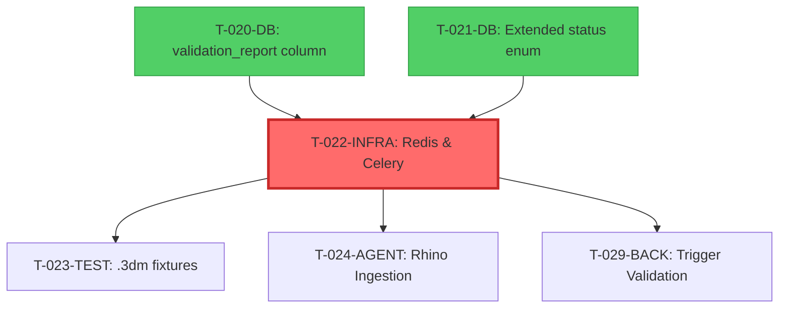

# Technical Specification: T-022-INFRA

**Ticket ID:** T-022-INFRA  
**Title:** Redis & Celery Worker Setup  
**Status:** Enrichment Phase (Pre-TDD)  
**Created:** 2026-02-12  
**Dependencies:** T-020-DB ✅, T-021-DB ✅

---

## 1. Ticket Summary

- **Tipo:** INFRA (Infrastructure + Agent Layer)
- **Alcance:** Configurar infraestructura de procesamiento asíncrono usando Redis como message broker y Celery como task queue system para orquestar trabajos del agente "The Librarian"
- **Dependencias:**
  - T-020-DB ✅ (validation_report column existe)
  - T-021-DB ✅ (block_status enum extendido)
  - Docker Compose configurado
  - Supabase Storage configurado
- **Prioridad:** 🔴 CRÍTICA (Bloqueante para T-024 a T-032)

### Definition of Done (DoD)
- [x] `docker-compose up agent-worker` ejecuta sin errores
- [x] Task dummy funciona y se puede invocar
- [x] Variables `CELERY_BROKER_URL`, `CELERY_RESULT_BACKEND` configuradas
- [x] Redis accesible desde backend y agent-worker
- [x] Worker logs estructurados visibles en stdout
- [x] Tests de integración validan conectividad

---

## 2. Architectural Design

### 2.1. Service Topology

```
┌─────────────────────────────────────────────────────────────┐
│                     Docker Network (sf-network)             │
│                                                             │
│  ┌──────────┐      ┌───────────┐      ┌──────────────┐    │
│  │ Backend  │─────▶│  Redis    │◀─────│ Agent Worker │    │
│  │ (FastAPI)│      │  (Broker) │      │  (Celery)    │    │
│  └──────────┘      └───────────┘      └──────────────┘    │
│       │                                        │            │
│       │                                        │            │
│       ▼                                        ▼            │
│  ┌──────────────────────────────────────────────────┐      │
│  │         PostgreSQL (Supabase/Local)             │      │
│  └──────────────────────────────────────────────────┘      │
│                                                             │
└─────────────────────────────────────────────────────────────┘
```

### 2.2. Message Flow (Asynchronous Processing)

```
1. Backend recibe upload confirmation (POST /api/upload/confirm)
   ↓
2. Backend encola tarea Celery: validate_file.delay(part_id, s3_key)
   ↓
3. Tarea se publica en Redis Queue
   ↓
4. Agent Worker consume tarea de la queue
   ↓
5. Worker ejecuta validación Rhino (T-024, T-025, T-026, T-027)
   ↓
6. Worker actualiza DB con resultado (validation_report, status)
   ↓
7. Frontend recibe notificación vía Supabase Realtime (T-031)
```

### 2.3. Technology Stack

| Component | Technology | Version | Purpose |
|-----------|-----------|---------|---------|
| Message Broker | Redis | 7-alpine | Task queue, result backend |
| Task Queue | Celery | ^5.3.0 | Distributed task orchestration |
| Worker Runtime | Python | 3.11-slim | Execution environment |
| Serialization | JSON | - | Message format (safe, human-readable) |
| Monitoring | Celery Flower | ^2.0.1 | UI for task monitoring (optional MVP) |

---

## 3. Infrastructure Components

### 3.1. Docker Compose Services

#### A. Redis Service

```yaml
redis:
  image: redis:7-alpine
  container_name: sf-pm-redis
  ports:
    - "127.0.0.1:6379:6379"  # Localhost only
  command: redis-server --appendonly yes
  volumes:
    - redis_data:/data
  healthcheck:
    test: ["CMD", "redis-cli", "ping"]
    interval: 10s
    timeout: 5s
    retries: 5
  networks:
    - sf-network
```

**Design Decisions:**
- **Port binding:** `127.0.0.1:6379` → No external access (security)
- **Persistence:** `--appendonly yes` → AOF for durability
- **Health check:** `redis-cli ping` → Ensures readiness before worker starts
- **Volume:** Named volume `redis_data` → Survives container restarts

#### B. Agent Worker Service

```yaml
agent-worker:
  build:
    context: ./src/agent
    target: dev
  container_name: sf-pm-agent-worker
  env_file:
    - .env
  volumes:
    - ./src/agent:/app
    - ./tests:/app/tests
  environment:
    - CELERY_BROKER_URL=redis://redis:6379/0
    - CELERY_RESULT_BACKEND=redis://redis:6379/0
    - SUPABASE_URL=${SUPABASE_URL}
    - SUPABASE_KEY=${SUPABASE_KEY}
    - DATABASE_URL=${DATABASE_URL}
  depends_on:
    redis:
      condition: service_healthy
    db:
      condition: service_healthy
  networks:
    - sf-network
  command: celery -A agent.celery_app worker --loglevel=info --concurrency=2
```

**Design Decisions:**
- **Concurrency:** `--concurrency=2` → 2 parallel workers (MVP scope)
- **Loglevel:** `info` → Structured logs without debug noise
- **Depends on:** Redis + DB健康检查 → No race conditions on startup
- **Volume mount:** Hot-reload for development
- **Network:** Shared `sf-network` → Can access backend, redis, db

### 3.2. Docker Volumes

```yaml
volumes:
  postgres_data:
  redis_data:  # NEW: Persist Redis AOF logs
```

---

## 4. Agent Layer Architecture

### 4.1. Directory Structure (src/agent/)

```
src/agent/
├── __init__.py                # Package marker
├── celery_app.py              # Celery application instance
├── tasks.py                   # Task definitions (dummy + future validators)
├── requirements.txt           # Agent-specific dependencies
├── Dockerfile                 # Multi-stage build (dev/prod)
└── config.py                  # Configuration (mirrors backend pattern)
```

### 4.2. Celery Application Contract

**File:** `src/agent/celery_app.py`

```python
# NOT IMPLEMENTED YET - CONTRACT ONLY

from celery import Celery
from .config import settings

celery_app = Celery(
    "sf_pm_agent",
    broker=settings.CELERY_BROKER_URL,
    backend=settings.CELERY_RESULT_BACKEND
)

# Configuration
celery_app.conf.update(
    task_serializer="json",           # Security: avoid pickle
    result_serializer="json",
    accept_content=["json"],
    timezone="UTC",
    enable_utc=True,
    task_track_started=True,          # Track "STARTED" state
    task_time_limit=600,              # 10min hard timeout (OOM protection)
    task_soft_time_limit=540,         # 9min soft timeout (graceful shutdown)
    worker_prefetch_multiplier=1,     # Fetch 1 task at a time (large files)
    result_expires=3600,              # Results expire after 1h
)
```

**Key Configuration Choices:**
- **Serializer:** JSON (not pickle) → Prevents code injection vulnerabilities
- **Timeouts:** 10min hard, 9min soft → Handles large .3dm files (500MB max)
- **Prefetch:** 1 → Prevents worker hoarding (critical for large file processing)
- **Result TTL:** 1h → Cleanup old results automatically

### 4.3. Task Definitions

**File:** `src/agent/tasks.py`

```python
# NOT IMPLEMENTED YET - CONTRACT ONLY

from .celery_app import celery_app
import structlog

logger = structlog.get_logger()

@celery_app.task(
    name="agent.tasks.health_check",
    bind=True,
    max_retries=0
)
def health_check(self):
    """
    Dummy task for infrastructure validation.
    Returns worker metadata to confirm Celery is operational.
    """
    return {
        "status": "healthy",
        "worker_id": self.request.id,
        "hostname": self.request.hostname,
        "timestamp": self.request.eta or "now"
    }

@celery_app.task(
    name="agent.tasks.validate_file",
    bind=True,
    max_retries=3,
    default_retry_delay=60  # 1min between retries
)
def validate_file(self, part_id: str, s3_key: str):
    """
    PLACEHOLDER - To be implemented in T-024-AGENT.
    
    This task will:
    1. Download .3dm from S3 to /tmp
    2. Parse with rhino3dm.File3dm.Read()
    3. Extract metadata (T-025)
    4. Validate nomenclature (T-026)
    5. Validate geometry (T-027)
    6. Update blocks table with validation_report
    """
    logger.info("validate_file.started", part_id=part_id, s3_key=s3_key)
    # Implementation in T-024
    raise NotImplementedError("Placeholder for T-024-AGENT")
```

**Task Design Patterns:**
- **bind=True:** Access to `self.request` (worker metadata, retry context)
- **max_retries:** 3 for file processing (network transient errors), 0 for health check
- **Structured logging:** `structlog` for JSON logs (observability)

### 4.4. Configuration Module

**File:** `src/agent/config.py`

```python
# NOT IMPLEMENTED YET - CONTRACT ONLY

from pydantic_settings import BaseSettings, SettingsConfigDict
from typing import Optional

class Settings(BaseSettings):
    """
    Agent-specific configuration.
    Mirrors backend pattern for consistency.
    """
    # Celery
    CELERY_BROKER_URL: str = "redis://redis:6379/0"
    CELERY_RESULT_BACKEND: str = "redis://redis:6379/0"
    
    # Database (for direct writes)
    DATABASE_URL: str
    
    # Supabase (for S3 downloads)
    SUPABASE_URL: str
    SUPABASE_KEY: str
    
    # File Processing Limits
    MAX_FILE_SIZE_MB: int = 500
    TEMP_DIR: str = "/tmp/sf-pm-agent"
    
    model_config = SettingsConfigDict(
        env_file=".env",
        env_file_encoding="utf-8",
        extra="ignore"
    )

settings = Settings()
```

### 4.5. Agent Dockerfile

**File:** `src/agent/Dockerfile`

```dockerfile
# NOT IMPLEMENTED YET - CONTRACT ONLY

# === Base: production dependencies ===
FROM python:3.11-slim AS base
WORKDIR /app

# Install system dependencies for rhino3dm (future T-024)
RUN apt-get update && apt-get install -y \
    build-essential \
    && rm -rf /var/lib/apt/lists/*

COPY requirements.txt .
RUN pip install --no-cache-dir -r requirements.txt

COPY . .

# === Dev: hot-reload + test dependencies ===
FROM base AS dev
# No additional dependencies yet (tests in T-024+)
CMD ["celery", "-A", "agent.celery_app", "worker", "--loglevel=info", "--concurrency=2"]

# === Prod: non-root user, production concurrency ===
FROM base AS prod
RUN useradd -m agentuser
USER agentuser
CMD ["celery", "-A", "agent.celery_app", "worker", "--loglevel=warning", "--concurrency=4"]
```

**Design Decisions:**
- **Base image:** `python:3.11-slim` → Matches backend for consistency
- **System deps:** `build-essential` → Required for compiling rhino3dm wheels
- **Concurrency:** 2 (dev), 4 (prod) → Tuned for memory usage
- **User:** Non-root in prod → Security best practice

### 4.6. Agent Requirements

**File:** `src/agent/requirements.txt`

```txt
# NOT IMPLEMENTED YET - CONTRACT ONLY

celery==5.3.4
redis==5.0.1
pydantic==2.6.1
pydantic-settings==2.1.0
python-dotenv==1.0.1
structlog==24.1.0

# Database access
psycopg2-binary==2.9.9
supabase==2.10.0

# Future dependencies (T-024+)
# rhino3dm==8.4.0  # Uncomment in T-024-AGENT
```

**Dependency Rationale:**
- **celery + redis:** Core task queue
- **pydantic/pydantic-settings:** Config validation (mirrors backend)
- **structlog:** Structured JSON logging
- **psycopg2 + supabase:** Direct DB access + S3 downloads
- **rhino3dm:** Commented until T-024 (avoids unused large dependency)

---

## 5. Backend Integration Points

### 5.1. Configuration Updates

**File:** `src/backend/config.py`

**MODIFY:** Add Celery configuration

```python
class Settings(BaseSettings):
    # Existing fields...
    
    # Celery (NEW)
    CELERY_BROKER_URL: str = "redis://redis:6379/0"
    CELERY_RESULT_BACKEND: str = "redis://redis:6379/0"
```

**Rationale:** Backend will need to send tasks to Celery in T-029-BACK

### 5.2. Environment Variables

**File:** `.env.example`

**MODIFY:** Add Celery variables

```bash
# Celery (Task Queue)
CELERY_BROKER_URL=redis://redis:6379/0
CELERY_RESULT_BACKEND=redis://redis:6379/0
```

---

## 6. Test Strategy

### 6.1. Test Cases Checklist

#### ✅ Happy Path (Infrastructure Validation)

- [ ] **Test 1: Redis responds to PING**
  - Given: Redis container está iniciado
  - When: Se ejecuta `redis-cli ping` desde agent-worker
  - Then: Responde `PONG`
  - **Assertion:** `result == "PONG"`

- [ ] **Test 2: Worker inicia sin errores**
  - Given: docker-compose.yml configurado correctamente
  - When: Se ejecuta `docker-compose up agent-worker`
  - Then: Logs muestran "celery@hostname ready"
  - **Assertion:** Exit code 0, no stack traces en logs

- [ ] **Test 3: Health check task se ejecuta exitosamente**
  - Given: Worker corriendo
  - When: Se encola `health_check.delay()`
  - Then: Retorna `{"status": "healthy", "worker_id": "...", ...}`
  - **Assertion:** Task state = SUCCESS, result contains expected keys

#### ⚠️ Edge Cases (Error Handling)

- [ ] **Test 4: Worker reinicia automáticamente tras crash**
  - Given: Worker corriendo
  - When: Se envía SIGKILL al proceso worker
  - Then: Docker Compose reinicia el contenedor automáticamente
  - **Assertion:** Worker vuelve a estar "ready" en <30s

- [ ] **Test 5: Task falla y se reintenta (retry policy)**
  - Given: Task configurada con max_retries=3
  - When: Task lanza excepción temporal (ej: network timeout simulado)
  - Then: Celery reintenta 3 veces con delay de 60s
  - **Assertion:** Task states: PENDING → RETRY → RETRY → RETRY → FAILURE

#### 🛡️ Security/Configuration Validation

- [ ] **Test 6: Redis NO es accesible desde host externo**
  - Given: Redis binding = `127.0.0.1:6379`
  - When: Intento conexión desde fuera de Docker network
  - Then: Conexión rechazada
  - **Assertion:** `redis-cli -h <public-ip> ping` → Connection refused

- [ ] **Test 7: Serializer JSON rechaza pickle**
  - Given: Celery configurado con `accept_content=["json"]`
  - When: Intento enviar tarea serializada con pickle
  - Then: Celery rechaza el mensaje
  - **Assertion:** Error log contains "Received and deleted unknown message"

#### 🔗 Integration Tests

- [ ] **Test 8: Backend puede enviar task a worker**
  - Given: Backend y worker corriendo
  - When: Backend ejecuta `celery_app.send_task("agent.tasks.health_check")`
  - Then: Worker procesa la tarea y backend recibe resultado
  - **Assertion:** `AsyncResult(task_id).get(timeout=10) == {"status": "healthy", ...}`

- [ ] **Test 9: Worker puede escribir en PostgreSQL**
  - Given: Worker tiene DATABASE_URL configurado
  - When: Task ejecuta query simple (`SELECT 1`)
  - Then: Query ejecuta sin errores
  - **Assertion:** Connection successful, no psycopg2 errors

- [ ] **Test 10: Worker puede leer de Supabase Storage**
  - Given: Worker tiene SUPABASE_URL + SUPABASE_KEY
  - When: Task intenta listar buckets de Supabase
  - Then: Retorna lista de buckets (ej: `raw-uploads`)
  - **Assertion:** `supabase_client.storage.list_buckets()` returns non-empty array

---

## 7. Files to Create/Modify

### 7.1. Create (New Files)

| File Path | Purpose | Owner | LoC Est. |
|-----------|---------|-------|----------|
| `src/agent/__init__.py` | Package marker | Agent | 1 |
| `src/agent/celery_app.py` | Celery application instance | Agent | ~30 |
| `src/agent/tasks.py` | Task definitions (health_check + placeholder validate_file) | Agent | ~40 |
| `src/agent/config.py` | Configuration module (Settings class) | Agent | ~25 |
| `src/agent/requirements.txt` | Python dependencies | Agent | ~10 |
| `src/agent/Dockerfile` | Multi-stage Docker build | Agent | ~20 |
| `tests/integration/test_celery_worker.py` | Integration tests (10 test cases) | Testing | ~150 |

**Total Estimated LoC:** ~276 lines

### 7.2. Modify (Existing Files)

| File Path | Change Description | Lines Changed |
|-----------|-------------------|---------------|
| `docker-compose.yml` | Add `redis` service (15 lines) + `agent-worker` service (18 lines) + `redis_data` volume (1 line) | ~34 |
| `src/backend/config.py` | Add `CELERY_BROKER_URL` and `CELERY_RESULT_BACKEND` to Settings class | ~3 |
| `.env.example` | Document Celery environment variables | ~3 |

**Total Lines Modified:** ~40 lines

---

## 8. Reusable Components/Patterns

### 8.1. From Existing Codebase

- **Multi-stage Dockerfile pattern** (`src/backend/Dockerfile`) → Reutilizado en `src/agent/Dockerfile`
- **Pydantic Settings pattern** (`src/backend/config.py`) → Replicado en `src/agent/config.py`
- **Health check pattern** (docker-compose `db` service) → Aplicado a `redis` y `agent-worker`
- **Volume persistence pattern** (`postgres_data`) → Aplicado a `redis_data`
- **Network isolation** (`sf-network`) → Agent-worker se une a la red existente
- **Port binding security** (`127.0.0.1:5432` en db) → Replicado en Redis

### 8.2. New Patterns Introduced (For Future Reuse)

- **Celery task retry policy** → Reutilizable en T-024 a T-027 (file processing tasks)
- **JSON serialization for tasks** → Security pattern for all future tasks
- **Structured logging with structlog** → Extendible a backend en futuras iteraciones
- **Worker concurrency tuning** → Template para optimización de workers

---

## 9. Dependency Graph



**Critical Path:** T-022 es bloqueante para:
- T-024 (Rhino Ingestion Service) → Necesita worker Celery
- T-029 (Trigger Validation from Confirm Endpoint) → Necesita Celery client en backend
- T-030 (Get Validation Status Endpoint) → Necesita async result tracking

---

## 10. Risk Assessment & Mitigation

### 10.1. Technical Risks

| Risk | Probability | Impact | Mitigation Strategy |
|------|------------|--------|---------------------|
| **Redis memory overflow** (large task metadata) | MEDIUM | HIGH | - Enable AOF persistence<br>- Set `result_expires=3600`<br>- Monitor memory usage in Flower |
| **Worker OOM crashes** (500MB .3dm files) | HIGH | HIGH | - Set `task_time_limit=600`<br>- Prefetch multiplier=1<br>- Add memory limit in docker-compose (future) |
| **Network partitions** (worker→redis→backend) | LOW | MEDIUM | - Health checks on all services<br>- Retry policies on tasks<br>- `depends_on` prevents race conditions |
| **Task serialization vulnerabilities** | LOW | CRITICAL | - Use JSON serializer (no pickle)<br>- Validate task inputs with Pydantic |

### 10.2. Development Risks

| Risk | Probability | Impact | Mitigation Strategy |
|------|------------|--------|---------------------|
| **Developer confusion** (new tech: Celery) | MEDIUM | LOW | - Clear documentation in this spec<br>- Health check task as template<br>- Structured logging for debugging |
| **Testing complexity** (async behaviors) | MEDIUM | MEDIUM | - Use `task.get(timeout=10)` in sync tests<br>- Mock `.delay()` in unit tests (T-029) |

---

## 11. Observability & Monitoring

### 11.1. Logging Strategy

**Format:** Structured JSON logs via `structlog`

**Example Log Entry:**
```json
{
  "event": "task_started",
  "task_name": "agent.tasks.validate_file",
  "task_id": "a1b2c3d4-...",
  "part_id": "12345",
  "s3_key": "uploads/model.3dm",
  "timestamp": "2026-02-12T14:30:00Z",
  "level": "info"
}
```

**Log Levels:**
- **INFO:** Task lifecycle (started, succeeded, retrying)
- **WARNING:** Soft timeout reached, retry attempts
- **ERROR:** Task failures, uncaught exceptions
- **CRITICAL:** Worker crashes, Redis connection lost

### 11.2. Metrics to Track (Future: T-033-INFRA)

- `task_duration_seconds{task_name="validate_file"}` → Histogram
- `task_failure_rate{task_name="validate_file"}` → Counter
- `worker_active_tasks` → Gauge
- `redis_memory_used_bytes` → Gauge

**Tools (optional MVP):**
- **Celery Flower:** Web UI for task monitoring (`pip install flower`)
- **Railway Metrics:** Built-in monitoring if deployed to Railway

---

## 12. Next Steps (Handoff to TDD-RED)

Esta especificación está completa y lista para iniciar **TDD-RED Phase**.

### 12.1. Pre-TDD Checklist

- [x] Arquitectura definida y validada
- [x] Contratos de configuración escritos (Celery app, tasks, config)
- [x] Test cases enumerados (10 tests total)
- [x] Archivos a crear/modificar identificados
- [x] Riesgos documentados y mitigados
- [x] Dependencias de otras tareas confirmadas (T-020 ✅, T-021 ✅)

### 12.2. TDD-RED Workflow

**Usar snippet:** `:tdd-red` con los siguientes valores:

```
=============================================
READY FOR TDD-RED PHASE - Copy these values:
=============================================
Ticket ID:       T-022-INFRA
Feature name:    Redis & Celery Worker Setup
Key test cases:  
  1. Redis responds to PING
  2. Worker inicia sin errores  
  3. Health check task ejecuta exitosamente
  4. Backend puede enviar task a worker
  5. Worker puede escribir en PostgreSQL
  
Files to create:
  - src/agent/__init__.py
  - src/agent/celery_app.py
  - src/agent/tasks.py
  - src/agent/config.py
  - src/agent/requirements.txt
  - src/agent/Dockerfile
  - tests/integration/test_celery_worker.py

Files to modify:
  - docker-compose.yml (add redis + agent-worker services)
  - src/backend/config.py (add CELERY_* vars)
  - .env.example (document Celery vars)
  
Expected Outcome:
  - All 10 integration tests FAIL (services not configured)
  - Tests clearly define what "working" looks like
  - Ready for TDD-GREEN implementation
=============================================
```

---

## 13. Appendix

### A. Celery Task States (Reference)

| State | Description | Terminal? |
|-------|-------------|-----------|
| PENDING | Task waiting in queue | No |
| STARTED | Worker picked up task | No |
| RETRY | Task failed, will retry | No |
| SUCCESS | Task completed successfully | Yes |
| FAILURE | Task failed (retries exhausted) | Yes |
| REVOKED | Task cancelled by user | Yes |

### B. Redis Persistence Modes

| Mode | Description | Use Case |
|------|-------------|----------|
| AOF (Append-Only File) | Logs every write operation | Durability (selected for this project) |
| RDB (Snapshotting) | Periodic full snapshots | Performance (not used) |
| Hybrid | Both AOF + RDB | Production (future consideration) |

### C. Useful Commands (Development)

```bash
# Check Redis connectivity
docker exec sf-pm-redis redis-cli ping

# Tail worker logs
docker-compose logs -f agent-worker

# Inspect active tasks
docker exec sf-pm-agent-worker celery -A agent.celery_app inspect active

# Purge all tasks from queue (dev only)
docker exec sf-pm-agent-worker celery -A agent.celery_app purge

# Run integration tests
docker-compose run --rm backend pytest tests/integration/test_celery_worker.py -v
```

---

**Status:** ✅ SPECIFICATION COMPLETE - READY FOR TDD-RED  
**Next Ticket Developer:** Use this document as the source of truth for implementation.  
**Questions/Clarifications:** Refer to `memory-bank/decisions.md` for ADR logging.
