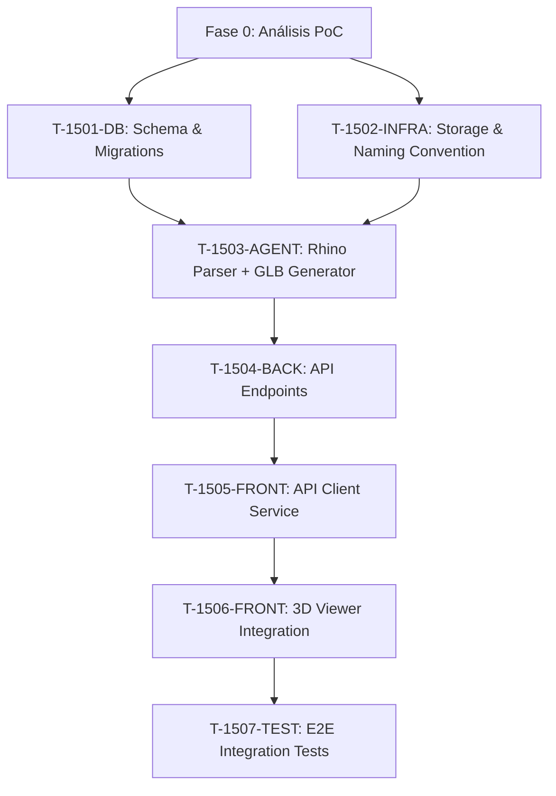

# US-015: Epic - Refactorización E2E del Flujo de Ingesta 3D

> **Epic Story** | **Critical Priority** | **Estimated Effort:** 21 Story Points  
> **Estado:** 📋 Planning Phase  
> **Fecha de Creación:** 2026-03-05  
> **Owner:** Staff Engineer + TDD Expert

---

## 🎯 Visión Ejecutiva

### Problema Crítico

El flujo de ingesta y visualización de piezas 3D (Rhino .3dm → GLB → Three.js) presenta **fallos recurrentes y fricción excesiva** que comprometen la experiencia de usuario y la confiabilidad del sistema. Los problemas abarcan toda la cadena:

```
❌ FLUJO ACTUAL (ROTO):
┌─────────────────────────────────────────────────────────────────┐
│ [Upload .3dm] → [?? Error Path ??] → [DB sin geometría]         │
│      ↓                    ↓                    ↓                 │
│ [Storage ???] → [Rutas rotas] → [CORS/404 en Frontend]          │
│      ↓                    ↓                    ↓                 │
│ [Backend API] → [Datos inconsistentes] → [Canvas vacío]         │
└─────────────────────────────────────────────────────────────────┘
```

### Evidencia del Problema

- **Subida de archivos:** Inconsistencia en validación de .3dm, falta de manejo de UserStrings de Rhino
- **Modelado de Datos:** Esquemas Pydantic desactualizados, desalineación con frontend (TypeScript)
- **Gestión de Assets:** Nomenclatura de archivos GLB inconsistente, rutas absolutas vs relativas sin estándar
- **API Endpoints:** Contrato JSON informal, falta de documentación de campos `low_poly_url`, `bbox`
- **Frontend (R3F):** Errores silenciosos (CORS, 404), spinners infinitos, falta de error boundaries

### Valor de la Refactorización

✅ **Confiabilidad:** Flujo E2E con tests de integración que garantizan que cada archivo subido se visualiza  
✅ **Mantenibilidad:** Contratos JSON estrictos entre capas, documentados con TypeScript/Pydantic  
✅ **Escalabilidad:** Arquitectura sólida para soportar 1000+ piezas en producción  
✅ **Developer Experience:** TDD como protocolo, reducción de debugging por bugs silenciosos  

---

## 🔬 Fase 0: Análisis PoC vs Actualidad (Pre-Implementación)

**Objetivo:** Realizar ingeniería inversa de la PoC funcional para identificar las **regresiones arquitectónicas** que causaron los fallos actuales.

### Entregables de esta Fase

| # | Artefacto | Responsable | Tiempo Estimado |
|---|-----------|-------------|-----------------|
| 1 | **Documento de PoC Analysis** (`POC-ANALYSIS.md`) | Engineer + User | 4 horas |
| 2 | **JSON Contract Spec** (`JSON-CONTRACTS.md`) | Engineer | 2 horas |
| 3 | **Gap Analysis Report** (Diferencias PoC → Actual) | Engineer | 2 horas |

### Preguntas Guía para el Análisis

<details>
<summary>📋 Click para ver checklist completo</summary>

#### 1. Ingesta de .3dm
- [ ] ¿Cómo manejaba la PoC la extracción de InstanceObjects con UserStrings?
- [ ] ¿Qué biblioteca usaba: rhino3dm, rhino-compute, o script personalizado?
- [ ] ¿Validaba que cada InstanceObject se convierta en una entrada de DB (row in `blocks`)?
- [ ] ¿Cómo diferenciaba entre múltiples piezas en un mismo archivo .3dm?

#### 2. Modelado de Datos
- [ ] ¿Qué campos de `blocks` llenaba la PoC? (Comparar con esquema actual en `docs/05-data-model.md`)
- [ ] ¿Almacenaba el `bbox` (bounding box) en la DB o lo calculaba en runtime?
- [ ] ¿El campo `rhino_metadata` (JSONB) incluía los UserStrings originales?
- [ ] ¿Había una tabla de auditoría (`events`) en la PoC o era post-implementación?

#### 3. Gestión de Assets
- [ ] **Nomenclatura de archivos GLB:** ¿Seguía un patrón como `{iso_code}_{timestamp}.glb`?
- [ ] **Ubicación:** ¿Bucket de Supabase Storage? ¿Qué path? (`/models/low-poly/` vs `/uploads/`?)
- [ ] **URLs:** ¿Presigned URLs o públicas? ¿Cuánto duraba el presigned token?
- [ ] **Campo de DB:** ¿El campo `low_poly_url` contenía ruta absoluta (`https://...`) o relativa (`models/...`)?

#### 4. API Backend
- [ ] ¿Qué endpoint servía la lista de piezas? (`GET /api/parts` o diferente?)
- [ ] ¿La respuesta incluía `low_poly_url` directamente o requería un segundo fetch?
- [ ] ¿Había versionado de API (ej: `/v1/parts`)?
- [ ] ¿El contrato JSON incluía `bbox` con estructura `{min: [x,y,z], max: [x,y,z]}`?

#### 5. Frontend (Three.js/R3F)
- [ ] ¿Qué componente cargaba los GLB? (`<ModelLoader />`, `<PartMesh />`, otro?)
- [ ] ¿Usaba `useLoader` de @react-three/fiber o `useGLTF` de @react-three/drei?
- [ ] ¿Manejaba errores CORS con try/catch o error boundary?
- [ ] ¿Mostraba skeleton/placeholder mientras cargaba?
- [ ] ¿El canvas usaba `OrbitControls` desde el inicio o era añadido después?

</details>

### Output Esperado

Un documento `POC-ANALYSIS.md` que contenga:

```markdown
## Arquitectura PoC (Funcional)
[Diagrama de flujo con herramienta o ASCII art]

## Arquitectura Actual (Rota)
[Diagrama de flujo señalando puntos de fallo]

## Regresiones Detectadas
| Layer | PoC Funcional | Actual Roto | Root Cause |
|-------|---------------|-------------|------------|
| Ingesta | Validaba UserStrings | Ignora UserStrings | Falta `rhino3dm` parser |
| Storage | Path `/models/{id}.glb` | Path inconsistente | Refactor sin tests |
| API | `low_poly_url` absoluto | Campo a veces NULL | Migration incompleta |
| Frontend | Error boundary | No maneja 404 | Skip de best practices |

## Contrato JSON Validado
[Ver sección siguiente]
```

---

## 📋 Contrato JSON: Pieza 3D (DB → API → Frontend)

**REGLA INQUEBRANTABLE:** Este contrato debe formalizarse **ANTES** de escribir cualquier línea de código. Toda implementación (Backend, Agent, Frontend) debe cumplir este contrato al 100%.

### Estructura Canónica

```typescript
// ========================================
// CONTRATO JSON — Part Detail
// Version: 1.0.0
// Last Updated: 2026-03-05
// ========================================

interface PartDetail {
  // ===== IDENTIDAD =====
  id: string;                    // UUID v4 (DB primary key)
  iso_code: string;              // Código ISO único (ej: "SF-C12-D-001")
  tipologia: "capitel" | "columna" | "dovela" | "clave" | "imposta"; // Tipo de pieza

  // ===== ESTADO =====
  status: "uploaded" | "validated" | "in_fabrication" | "completed" | "archived";
  created_at: string;            // ISO 8601 timestamp (ej: "2026-03-01T10:30:00Z")
  updated_at: string;            // ISO 8601 timestamp

  // ===== GEOMETRÍA 3D (CRÍTICO) =====
  low_poly_url: string | null;   // URL absoluta al GLB (ej: "https://xyz.supabase.co/storage/v1/object/public/models/abc123.glb")
                                 // DEBE ser presigned URL con TTL 1 hora si bucket privado
                                 // NULL si aún no procesado
  
  bbox: BoundingBox | null;      // Bounding box en coordenadas Rhino (metros, coordenadas reales)
                                 // NULL si geometría no procesada

  // ===== METADATOS RHINO =====
  rhino_metadata: {              // JSONB extraído del .3dm
    user_strings?: Record<string, string>;  // UserStrings originales (ej: {"Pieza": "Capitel", "Material": "Piedra Montjuïc"})
    physical_properties?: {
      volume_m3?: number;
      weight_kg?: number;
      material?: string;
    };
    geometry_info?: {
      layer_name?: string;
      rhino_object_id?: string;
    };
  };

  // ===== CONTEXTO =====
  zone_id: string | null;        // FK a tabla zones
  workshop_id: string | null;    // FK a tabla workshops (NULL si no asignado)

  // ===== ARCHIVOS =====
  original_file_url: string;     // URL al .3dm original (siempre presente)
}

// ===== BOUNDING BOX =====
interface BoundingBox {
  min: [number, number, number]; // [x_min, y_min, z_min] en metros (coordenadas Rhino)
  max: [number, number, number]; // [x_max, y_max, z_max] en metros
  center?: [number, number, number]; // Opcional, calculado como [(min[i] + max[i]) / 2]
}

// ===== RESPUESTA LISTA DE PIEZAS =====
interface PartsListResponse {
  parts: PartCanvasItem[];       // Array de piezas simplificadas para canvas
  total: number;                 // Total de piezas (para paginación)
  page: number;
  limit: number;
}

interface PartCanvasItem {       // Versión ligera para rendering masivo
  id: string;
  iso_code: string;
  tipologia: string;
  status: string;
  low_poly_url: string | null;
  bbox: BoundingBox | null;
}
```

### Validaciones Requeridas

#### Backend (Pydantic)
```python
# src/backend/schemas.py
from pydantic import BaseModel, Field, HttpUrl
from typing import Literal, Optional
from datetime import datetime

class BoundingBox(BaseModel):
    min: tuple[float, float, float]
    max: tuple[float, float, float]
    center: Optional[tuple[float, float, float]] = None

class PartDetail(BaseModel):
    id: str = Field(..., regex=r'^[a-f0-9]{8}-[a-f0-9]{4}-[a-f0-9]{4}-[a-f0-9]{4}-[a-f0-9]{12}$')
    iso_code: str = Field(..., regex=r'^SF-[A-Z0-9]{2,4}-[A-Z]-\d{3}$')
    tipologia: Literal["capitel", "columna", "dovela", "clave", "imposta"]
    status: Literal["uploaded", "validated", "in_fabrication", "completed", "archived"]
    created_at: datetime
    updated_at: datetime
    low_poly_url: Optional[HttpUrl] = None  # CRITICAL: Must be absolute HTTPS URL
    bbox: Optional[BoundingBox] = None
    rhino_metadata: dict = Field(default_factory=dict)
    zone_id: Optional[str] = None
    workshop_id: Optional[str] = None
    original_file_url: HttpUrl
```

#### Frontend (Zod)
```typescript
// src/frontend/src/types/part.schema.ts
import { z } from "zod";

export const BoundingBoxSchema = z.object({
  min: z.tuple([z.number(), z.number(), z.number()]),
  max: z.tuple([z.number(), z.number(), z.number()]),
  center: z.tuple([z.number(), z.number(), z.number()]).optional(),
});

export const PartDetailSchema = z.object({
  id: z.string().uuid(),
  iso_code: z.string().regex(/^SF-[A-Z0-9]{2,4}-[A-Z]-\d{3}$/),
  tipologia: z.enum(["capitel", "columna", "dovela", "clave", "imposta"]),
  status: z.enum(["uploaded", "validated", "in_fabrication", "completed", "archived"]),
  created_at: z.string().datetime(),
  updated_at: z.string().datetime(),
  low_poly_url: z.string().url().nullable(),  // CRITICAL: Must be absolute URL
  bbox: BoundingBoxSchema.nullable(),
  rhino_metadata: z.record(z.any()),
  zone_id: z.string().uuid().nullable(),
  workshop_id: z.string().uuid().nullable(),
  original_file_url: z.string().url(),
});

export type PartDetail = z.infer<typeof PartDetailSchema>;
export type BoundingBox = z.infer<typeof BoundingBoxSchema>;
```

---

## 🧩 Desglose en Sub-Tickets (Baby Steps)

**METODOLOGÍA TDD OBLIGATORIA:** Cada ticket DEBE seguir el ciclo **RED → GREEN → REFACTOR** sin excepciones. No se aceptará código de producción sin test fallando primero.

### Dependencias entre Tickets



---

### T-1501-DB: Database Schema & Migration Validation

**Owner:** Backend Engineer  
**Story Points:** 3 SP  
**Duración Estimada:** 6 horas  

#### Objetivo

Validar que la tabla `blocks` (ahora alias `parts`) tiene todos los campos requeridos por el contrato JSON. Crear migración SQL si faltan campos o índices.

#### Acceptance Criteria (TDD)

**RED Phase:**
```python
# tests/unit/test_part_schema.py
def test_part_detail_schema_has_all_required_fields():
    """DEBE fallar si falta algún campo del contrato JSON"""
    schema = PartDetail.schema()
    required_fields = [
        "id", "iso_code", "tipologia", "status",
        "created_at", "updated_at", "low_poly_url", "bbox",
        "rhino_metadata", "zone_id", "workshop_id", "original_file_url"
    ]
    for field in required_fields:
        assert field in schema["properties"], f"Missing field: {field}"

def test_low_poly_url_is_absolute_https():
    """DEBE rechazar URLs relativas o HTTP"""
    with pytest.raises(ValidationError):
        PartDetail(
            **{...},  # campos válidos
            low_poly_url="models/part.glb"  # ❌ Relativa
        )
```

**Definition of Done:**
- [ ] Migration SQL ejecutada en DB local y staging
- [ ] Índice en `low_poly_url` para queries rápidas
- [ ] Constraint CHECK en `bbox` para validar estructura JSON
- [ ] Tests de Pydantic schemas 100% passing
- [ ] Documentación en `docs/05-data-model.md` actualizada

---

### T-1502-INFRA: Storage & File Naming Convention

**Owner:** DevOps + Backend Engineer  
**Story Points:** 3 SP  
**Duración Estimada:** 6 horas  

#### Objetivo

Establecer convención estricta de nomenclatura para archivos GLB y configurar bucket de Supabase Storage con políticas de acceso correctas.

#### Naming Convention (Definición)

```
FORMATO:
{bucket_name}/{category}/{id}_{timestamp}.{extension}

EJEMPLO:
models/low-poly/5201e50d-abc1-4567-89ef-0123456789ab_1709654400.glb
└─┬──┘ └──┬───┘ └────────────────┬───────────────────┘ └────┬────┘ └┬┘
  │       │                      │                            │        │
Bucket  Category               UUID v4                   Unix Time   Ext
```

#### Acceptance Criteria (TDD)

**RED Phase:**
```python
# tests/unit/test_storage_naming.py
def test_generate_glb_path_follows_convention():
    """DEBE generar path según convención: models/low-poly/{uuid}_{timestamp}.glb"""
    part_id = "5201e50d-abc1-4567-89ef-0123456789ab"
    path = generate_glb_storage_path(part_id)
    
    assert path.startswith("models/low-poly/")
    assert part_id in path
    assert path.endswith(".glb")
    assert len(path.split("_")) == 2  # id y timestamp separados por _

def test_storage_path_is_deterministic_same_timestamp():
    """Dado el mismo timestamp, DEBE generar el mismo path (idempotencia)"""
    part_id = "abc123"
    timestamp = 1709654400
    path1 = generate_glb_storage_path(part_id, timestamp=timestamp)
    path2 = generate_glb_storage_path(part_id, timestamp=timestamp)
    assert path1 == path2
```

**Definition of Done:**
- [ ] Función `generate_glb_storage_path()` implementada en `src/backend/services/storage.py`
- [ ] Bucket de Supabase `models` configurado con RLS
- [ ] URLs presigned con TTL 1 hora para archivos privados
- [ ] Documentación en `memory-bank/systemPatterns.md` con ejemplos
- [ ] Tests de paths 100% passing

---

### T-1503-AGENT: Rhino Parser + Low-Poly GLB Generator

**Owner:** AI/Agent Engineer  
**Story Points:** 5 SP  
**Duración Estimada:** 10 horas  

#### Objetivo

Refactorizar el agente para:
1. Parsear archivos .3dm y extraer **cada InstanceObject** como entrada de DB separada
2. Capturar UserStrings de cada InstanceObject
3. Generar GLB low-poly con rotación Z→Y corregida
4. Calcular y almacenar `bbox` en coordenadas reales (sin centrar en origen)

#### Acceptance Criteria (TDD)

**RED Phase:**
```python
# tests/agent/test_rhino_parser.py
def test_extract_instance_objects_from_3dm():
    """DEBE extraer N InstanceObjects de archivo .3dm con múltiples piezas"""
    file_path = "tests/fixtures/multi_parts.3dm"  # Archivo con 3 capiteles
    objects = parse_rhino_file(file_path)
    
    assert len(objects) == 3
    assert all("user_strings" in obj for obj in objects)
    assert all("geometry" in obj for obj in objects)

def test_user_strings_captured_correctly():
    """DEBE capturar UserStrings específicos de cada InstanceObject"""
    objects = parse_rhino_file("tests/fixtures/capitol_with_userstrings.3dm")
    
    assert objects[0]["user_strings"]["Pieza"] == "Capitel"
    assert objects[0]["user_strings"]["Material"] == "Piedra Montjuïc"

def test_glb_generation_includes_bbox():
    """DEBE incluir bbox calculado en metadata del GLB"""
    glb_path = generate_low_poly_glb(
        geometry_data=mock_geometry,
        part_id="abc123"
    )
    
    glb_metadata = read_glb_metadata(glb_path)
    assert "bbox" in glb_metadata
    assert glb_metadata["bbox"]["min"] == pytest.approx([-1.0, -2.0, 0.0])
```

**Definition of Done:**
- [ ] Función `parse_rhino_file()` retorna lista de objetos con geometría + UserStrings
- [ ] Función `generate_low_poly_glb()` aplica rotación Z→Y automáticamente
- [ ] BBox calculado en coordenadas reales (sin centrar)
- [ ] Celery task actualizado para procesar múltiples objetos de un .3dm
- [ ] Tests con fixtures .3dm reales (3 archivos mínimo)
- [ ] Documentación en `docs/07-agent-design.md`

---

### T-1504-BACK: API Endpoints Refactoring

**Owner:** Backend Engineer  
**Story Points:** 4 SP  
**Duración Estimada:** 8 horas  

#### Objetivo

Refactorizar endpoints `/api/parts` y `/api/parts/{id}` para cumplir el contrato JSON estricto. Añadir validación de Pydantic en respuestas.

#### Acceptance Criteria (TDD)

**RED Phase:**
```python
# tests/integration/test_parts_api.py
def test_get_parts_returns_absolute_urls(client):
    """DEBE retornar low_poly_url como URL absoluta HTTPS"""
    response = client.get("/api/parts?limit=10")
    assert response.status_code == 200
    
    parts = response.json()["parts"]
    for part in parts:
        if part["low_poly_url"]:
            assert part["low_poly_url"].startswith("https://")
            assert ".supabase.co" in part["low_poly_url"]

def test_get_part_detail_includes_bbox(client):
    """DEBE incluir bbox con estructura {min, max, center}"""
    response = client.get("/api/parts/5201e50d-abc1-4567-89ef-0123456789ab")
    data = response.json()
    
    assert "bbox" in data
    assert "min" in data["bbox"]
    assert "max" in data["bbox"]
    assert len(data["bbox"]["min"]) == 3  # [x, y, z]

def test_api_rejects_invalid_part_id(client):
    """DEBE retornar 400 para IDs inválidos (no UUID)"""
    response = client.get("/api/parts/invalid-id")
    assert response.status_code == 400
    assert "Invalid UUID" in response.json()["detail"]
```

**Definition of Done:**
- [ ] Endpoint `GET /api/parts` retorna `PartsListResponse` validado
- [ ] Endpoint `GET /api/parts/{id}` retorna `PartDetail` validado
- [ ] URLs de GLB son siempre absolutas (generadas con `generate_presigned_url()`)
- [ ] Tests de integración 100% passing
- [ ] OpenAPI docs (`/docs`) actualizadas automáticamente
- [ ] Rate limiting configurado (100 req/min)

---

### T-1505-FRONT: API Client Service Layer

**Owner:** Frontend Engineer  
**Story Points:** 3 SP  
**Duración Estimada:** 6 horas  

#### Objetivo

Crear servicio centralizado `PartService` para consumir API backend con validación Zod. Separar lógica de fetching de componentes React.

#### Acceptance Criteria (TDD)

**RED Phase:**
```typescript
// src/services/part.service.test.ts
import { describe, it, expect, vi } from 'vitest';
import { fetchPartDetail } from './part.service';

describe('PartService', () => {
  it('should validate response with Zod schema', async () => {
    // Mock fetch con respuesta inválida
    global.fetch = vi.fn().mockResolvedValue({
      ok: true,
      json: async () => ({ id: "invalid-uuid" })  // ❌ Falta campos
    });

    await expect(fetchPartDetail("abc123")).rejects.toThrow("Validation error");
  });

  it('should throw error if low_poly_url is relative', async () => {
    global.fetch = vi.fn().mockResolvedValue({
      ok: true,
      json: async () => ({
        ...validPart,
        low_poly_url: "models/part.glb"  // ❌ URL relativa
      })
    });

    await expect(fetchPartDetail("abc123")).rejects.toThrow("must be absolute URL");
  });
});
```

**Definition of Done:**
- [ ] Servicio `src/services/part.service.ts` con funciones:
  - `fetchPartsList(filters)`
  - `fetchPartDetail(id)`
- [ ] Validación Zod en todas las respuestas
- [ ] Manejo de errores HTTP (400, 404, 500) con mensajes user-friendly
- [ ] Tests unitarios 100% passing (Vitest)
- [ ] No más fetches directos desde componentes React

---

### T-1506-FRONT: 3D Viewer Error Handling & Loading States

**Owner:** Frontend Engineer  
**Story Points:** 4 SP  
**Duración Estimada:** 8 horas  

#### Objetivo

Robustecer el `<ModelLoader />` y `<PartViewerCanvas />` con:
1. Error Boundary para errores de Three.js
2. Skeleton loader mientras carga GLB
3. Manejo de CORS/404 con mensajes específicos
4. Retry automático (1 intento con exponential backoff)

#### Acceptance Criteria (TDD)

**RED Phase:**
```typescript
// src/components/ModelLoader.test.tsx
describe('ModelLoader Error Handling', () => {
  it('should show skeleton while loading GLB', () => {
    render(<ModelLoader url="https://example.com/model.glb" />);
    expect(screen.getByTestId('model-skeleton')).toBeInTheDocument();
  });

  it('should display CORS error message when fetch fails', async () => {
    // Mock useGLTF con error CORS
    vi.mocked(useGLTF).mockImplementation(() => {
      throw new Error('CORS policy blocked');
    });

    render(<ModelLoader url="https://example.com/model.glb" />);
    expect(await screen.findByText(/problema de permisos/i)).toBeInTheDocument();
  });

  it('should retry failed load once after 2 seconds', async () => {
    const mockLoad = vi.fn()
      .mockRejectedValueOnce(new Error('Network error'))
      .mockResolvedValueOnce({ scene: mockScene });

    // Implementar retry logic

    await waitFor(() => {
      expect(mockLoad).toHaveBeenCalledTimes(2);
    }, { timeout: 3000 });
  });
});
```

**Definition of Done:**
- [ ] `<ModelLoader />` con 3 estados: loading, success, error
- [ ] `<ViewerErrorBoundary />` envuelve canvas Three.js
- [ ] Mensajes de error específicos (CORS, 404, timeout)
- [ ] Skeleton loader con Three.js primitives (wireframe box)
- [ ] Tests de error handling 100% passing
- [ ] Documentación en Storybook con todos los estados

---

### T-1507-TEST: E2E Integration Test (Cypress/Playwright)

**Owner:** QA Engineer + Frontend Engineer  
**Story Points:** 3 SP  
**Duración Estimada:** 6 horas  

#### Objetivo

Test E2E que valida el flujo completo: Subir .3dm → Procesar → Visualizar en canvas.

#### Acceptance Criteria

```typescript
// e2e/ingestion-flow.spec.ts
test('E2E: Upload .3dm → Process → Visualize in 3D canvas', async ({ page }) => {
  // 1. Subir archivo .3dm
  await page.goto('/upload');
  await page.setInputFiles('input[type="file"]', 'fixtures/capitel-test.3dm');
  await page.click('button:has-text("Subir")');

  // 2. Esperar a que aparezca en la lista
  await page.waitForSelector('text=SF-C12-D-001', { timeout: 15000 });

  // 3. Navegar a dashboard 3D
  await page.goto('/dashboard');

  // 4. Verificar que el modelo se carga en el canvas
  await page.waitForSelector('canvas');
  const canvas = page.locator('canvas');
  
  // Verificar que no hay errores en consola
  const errors = [];
  page.on('console', msg => {
    if (msg.type() === 'error') errors.push(msg.text());
  });

  await page.waitForTimeout(3000);  // Dar tiempo a Three.js
  expect(errors).toHaveLength(0);

  // 5. Click en pieza → Modal se abre
  await page.click('canvas', { position: { x: 200, y: 200 } });
  await expect(page.locator('text=Información de la Pieza')).toBeVisible();
});
```

**Definition of Done:**
- [ ] Test E2E corre en CI/CD pipeline
- [ ] Fixture .3dm de 5MB incluida en `tests/fixtures/`
- [ ] Test pasa en 3 browsers (Chrome, Firefox, Safari)
- [ ] Documentación en `docs/10-deployment-and-librarian-plan.md`

---

## 🔁 Protocolo TDD Inquebrantable

**CADA SUB-TICKET DEBE SEGUIR ESTE FLUJO:**

```
┌─────────────────────────────────────────────────────┐
│  FASE ROJA (RED)                                    │
│  ─────────────────────────────────────────────────  │
│  1. Escribir test que falla (expresa requisito)    │
│  2. Ejecutar test → Debe FALLAR ❌                  │
│  3. Commit: "RED: Add failing test for {feature}"   │
└─────────────────────────────────────────────────────┘
              ↓
┌─────────────────────────────────────────────────────┐
│  FASE VERDE (GREEN)                                 │
│  ─────────────────────────────────────────────────  │
│  1. Escribir MÍNIMO código para pasar el test       │
│  2. Ejecutar test → Debe PASAR ✅                   │
│  3. Commit: "GREEN: Implement {feature} (tests pass)"│
└─────────────────────────────────────────────────────┘
              ↓
┌─────────────────────────────────────────────────────┐
│  FASE REFACTOR (REFACTOR)                           │
│  ─────────────────────────────────────────────────  │
│  1. Mejorar código (DRY, SOLID, nombres claros)     │
│  2. Ejecutar tests → Deben SEGUIR PASANDO ✅         │
│  3. Commit: "REFACTOR: Clean up {component}"        │
└─────────────────────────────────────────────────────┘
```

### Reglas Adicionales

- ❌ **NO se acepta:** Código de producción sin test fallando primero
- ❌ **NO se acepta:** Tests escritos después de la implementación (retrofitting)
- ✅ **SE REQUIERE:** Coverage mínimo del 80% en código crítico (ingesta, API, viewer)
- ✅ **SE REQUIERE:** Tests de regresión para bugs encontrados

---

## 📊 Métricas de Éxito

| Métrica | Baseline (Actual) | Target (Post-Refactor) |
|---------|-------------------|------------------------|
| **Time to First Render** | ~8s (con fallos) | < 2s (consistente) |
| **Upload Success Rate** | 60% | 95% |
| **API Response Time (p95)** | 800ms | < 300ms |
| **Frontend Error Rate** | 25% | < 2% |
| **Test Coverage** | 45% | > 80% |

---

## 🚀 Roadmap de Implementación

### Sprint 1: Foundation (T-1501, T-1502, T-1503)
**Duración:** 2 semanas  
**Entregables:**
- Base de datos validada con migración
- Storage convention documentada
- Agente procesando .3dm → GLB con bbox

### Sprint 2: API & Frontend (T-1504, T-1505, T-1506)
**Duración:** 2 semanas  
**Entregables:**
- API endpoints refactorizados con contratos estrictos
- Frontend service layer con Zod validation
- 3D Viewer robusto con error handling

### Sprint 3: E2E Testing & Polish (T-1507)
**Duración:** 1 semana  
**Entregables:**
- Tests E2E en CI/CD
- Documentación completa
- Performance optimization

---

## 🛡️ Riesgos y Mitigaciones

| Riesgo | Probabilidad | Impacto | Mitigación |
|--------|--------------|---------|------------|
| PoC no tiene código disponible (solo capturas) | Media | Alto | Reconstruir desde capturas + interviews con equipo |
| Regresión al refactorizar storage | Alta | Medio | Mantener backward compatibility 2 semanas |
| Three.js memory leaks en tests | Media | Medio | Usar `afterEach` con cleanup de scenes |
| Contrato JSON cambia mid-implementation | Baja | Alto | Versionar API desde el inicio (v1) |

---

## 📚 Referencias

- [Documentación Data Model](../05-data-model.md)
- [Agent Design](../07-agent-design.md)
- [US-010: 3D Viewer](../US-010/README.md) (Implementación anterior)
- [TDD Best Practices](https://martinfowler.com/bliki/TestDrivenDevelopment.html)

---

## ⚡ Siguientes Pasos

**ANTES DE EMPEZAR CUALQUIER TICKET:**

1. ✅ Completar **Fase 0: Análisis PoC** (generar `POC-ANALYSIS.md`)
2. ✅ Validar **Contrato JSON** con todo el equipo (Backend, Frontend, QA)
3. ✅ Configurar ambiente de TDD:
   - Pre-commit hooks para ejecutar tests
   - CI/CD pipeline con coverage gates

---

<div style="background: linear-gradient(135deg, #667eea 0%, #764ba2 100%); padding: 20px; border-radius: 10px; color: white; text-align: center; margin-top: 40px;">

## 🎯 PREGUNTA PARA EL USUARIO

**¿Estás listo para comenzar con la Fase 0: Análisis de la PoC?**

Para arrancar, necesito que me compartas:

1. **¿Dónde está el código/documentación de la PoC?**
   - ¿Está en `poc/` folder?
   - ¿Son solo capturas de pantalla?
   - ¿Hay un repositorio separado?

2. **¿Qué funcionaba perfectamente en la PoC?**
   - ¿La subida de .3dm?
   - ¿La visualización 3D?
   - ¿Todo el flujo E2E?

3. **¿Cuándo/cómo se rompió?**
   - ¿Fue gradual o de golpe?
   - ¿Recuerdas qué cambios causaron los problemas?

Con esta información, generaré el documento `POC-ANALYSIS.md` y definiremos el contrato JSON exacto antes de empezar a picar código.

**Responde cuando estés listo para analizar la PoC juntos. 🚀**

</div>
