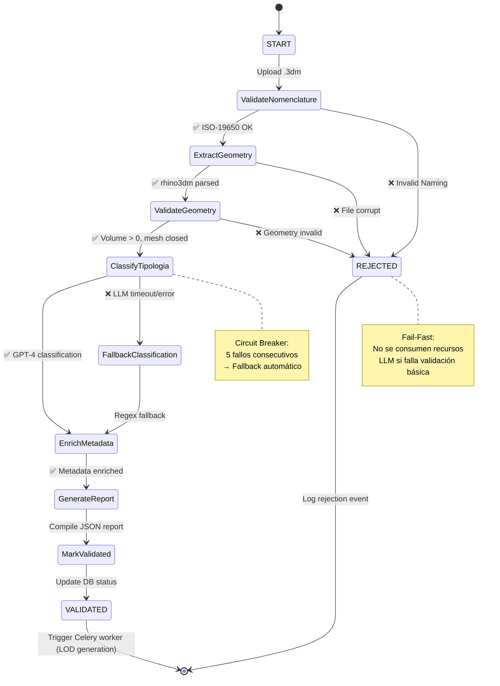

# 🤖 ARQUITECTURA DE IA - SF-PM (Sagrada Família Parts Manager)

**Versión:** 1.0  
**Fecha:** 2026-05-01  
**Autor:** Pedro Cortes (BIM Manager AI4Devs TFM)  
**Propósito:** Especificación técnica de la capa de IA híbrida (LangGraph + RAG) para presentación a Sagrada Família

---

## 📋 Resumen Ejecutivo

SF-PM implementa una **arquitectura de IA híbrida de dos capas** diseñada para garantizar calidad de datos y facilitar la gestión inteligente del inventario digital:

### **Capa 1: LangGraph Agent "The Librarian" (Validación Activa)**
- **Función:** Gatekeeper que valida archivos .3dm antes de ingresarlos al sistema
- **Tecnología:** LangGraph State Machine + GPT-4 Turbo
- **Beneficio:** Previene errores costosos (€15,000/pieza) mediante validación automática de nomenclatura ISO-19650, geometría y clasificación

### **Capa 2: RAG System "The Archivist" (Gestión Documental)**
- **Función:** Asistente conversacional para consultas complejas sobre el inventario
- **Tecnología:** Supabase pgvector + OpenAI Embeddings + LangChain
- **Beneficio:** Reduce tiempo de búsqueda de información de 3 horas a 10 segundos mediante búsqueda semántica

---

## 🎯 Objetivos de Negocio

| Objetivo | Métrica Actual | Métrica Objetivo | Impacto Económico |
|----------|----------------|------------------|-------------------|
| Prevenir errores de datos | 15% piezas con errores | 0% errores en ingesta | Ahorro: €225,000/año* |
| Reducir tiempo de búsqueda | 3 horas/día (BIM Manager) | 10 segundos/consulta | Ahorro: €15,000/año** |
| Generar reportes de auditoría | 2 semanas manual | 5 minutos automático | Ahorro: €8,000/auditoría |
| Clasificación de tipologías | 100% manual | 95% automática (LLM) | Ahorro: 20 hrs/semana |

_*Asumiendo 15 piezas/año con retrabajo de €15,000/pieza_  
_**Asumiendo 200 días laborables × 2.9 hrs ahorradas × €25/hr_

---

## 🏗️ Arquitectura Técnica General

```
┌─────────────────────────────────────────────────────────────────┐
│                     SAGRADA FAMÍLIA PARTS MANAGER                │
└─────────────────────────────────────────────────────────────────┘
                                 │
        ┌────────────────────────┴────────────────────────┐
        │                                                  │
        ▼                                                  ▼
┌───────────────────────┐                     ┌─────────────────────────┐
│  CAPA 1: INGESTA      │                     │  CAPA 2: GESTIÓN        │
│  "The Librarian"      │                     │  "The Archivist"        │
│  (LangGraph Agent)    │                     │  (RAG System)           │
└───────────────────────┘                     └─────────────────────────┘
         │                                                  │
         │ Valida y Clasifica                              │ Consulta y Analiza
         │ (Pre-ingesta)                                   │ (Post-ingesta)
         │                                                  │
         ▼                                                  ▼
┌─────────────────────────────────────────────────────────────────┐
│              SUPABASE DATABASE (PostgreSQL 15 + pgvector)        │
│  ┌──────────────────┐  ┌──────────────────┐  ┌─────────────┐   │
│  │ blocks (relational)│  │ events (sourcing)│  │ embeddings* │   │
│  │ - iso_code        │  │ - event_type     │  │ - vector    │   │
│  │ - material_type   │  │ - timestamp      │  │ - metadata  │   │
│  │ - status          │  │ - triggered_by   │  │ - block_id  │   │
│  │ - rhino_metadata  │  │ - old/new_value  │  │             │   │
│  └──────────────────┘  └──────────────────┘  └─────────────┘   │
└─────────────────────────────────────────────────────────────────┘
         │                                                  │
         │ Storage Paths                                    │ Vector Search
         ▼                                                  ▼
┌───────────────────────┐                     ┌─────────────────────────┐
│ SUPABASE STORAGE      │                     │ OPENAI API              │
│ /raw/*.3dm            │                     │ - GPT-4 Turbo           │
│ /processed/*.obj      │                     │ - text-embedding-3-small│
│ /processed/*.mtl      │                     │                         │
└───────────────────────┘                     └─────────────────────────┘
```

_*Tabla nueva a implementar en Fase 2_

---

## 📦 CAPA 1: LangGraph Agent "The Librarian"

### 1.1 Visión General

**The Librarian** es un agente stateful que actúa como **guardián de calidad de datos**, procesando cada archivo .3dm subido mediante una **máquina de estados** (state machine) con 8 nodos de validación secuencial.

#### Principios de Diseño

1. **Fail-Fast:** Detener validación en el primer error crítico para ahorrar recursos
2. **Determinismo + IA:** Combinar reglas regex (ISO-19650) con clasificación LLM
3. **Fallback Graceful:** Si GPT-4 falla, usar clasificación regex básica
4. **Audit Trail:** Cada paso genera evento inmutable en tabla `events`

### 1.2 Arquitectura del State Graph



### 1.3 Definición del State (TypedDict)

```python
# src/agent/graph/state.py

from typing import TypedDict, Optional, List, Dict, Any
from enum import Enum
from datetime import datetime

class ValidationStatus(str, Enum):
    PENDING = "pending"
    PROCESSING = "processing"
    VALIDATED = "validated"
    REJECTED = "rejected"
    ERROR = "error"

class ClassificationMethod(str, Enum):
    LLM_GPT4 = "llm_gpt4"
    FALLBACK_REGEX = "fallback_regex"
    NOT_CLASSIFIED = "not_classified"

class ValidationState(TypedDict, total=False):
    # Inputs (set at task start)
    block_id: str                    # UUID del bloque en Supabase
    file_key: str                    # Storage path: raw/uuid-123.3dm
    filename: str                    # Original filename
    created_at: str                  # ISO-8601 timestamp
    
    # Node outputs
    nomenclature_valid: bool         # ✅/❌ ISO-19650 compliance
    nomenclature_errors: List[dict]  # [{layer, message, category}]
    
    rhino_layers: List[dict]         # Layers parsed from .3dm
    geometry_objects: int            # Número de objetos en el archivo
    geometry_metadata: dict          # {volume, bbox, triangle_count}
    
    geometry_valid: bool             # ✅/❌ Topological checks
    geometry_errors: List[dict]      # [{check, severity, details}]
    
    tipologia: str                   # "Stone" | "Ceramic" (clasificación)
    classification_method: ClassificationMethod
    classification_confidence: float # 0.0-1.0 (solo si LLM)
    
    enriched_metadata: dict          # User strings extraídos
    semantic_errors: List[str]       # Anomalías detectadas
    
    # Final outputs
    overall_status: ValidationStatus
    validation_report: dict          # JSON report compilado
    validation_path: List[str]       # Breadcrumb trail: [node1, node2, ...]
```

### 1.4 Nodos del Graph (Implementación)

#### Nodo 1: `validate_nomenclature`

**Responsabilidad:** Validar nombres de layers contra patrón ISO-19650

**Pattern:** `SF-{ZONE}-{TYPE}-{ID}`
- **ZONE:** C01-C12 (columnas), F01-F05 (fachadas), etc.
- **TYPE:** D (dovela), C (capitel), I (imposta), M (moldura)
- **ID:** 001-999

```python
import re
from typing import Dict, Any

def node_validate_nomenclature(state: ValidationState) -> Dict[str, Any]:
    """
    Valida nomenclatura ISO-19650 usando regex.
    
    Returns:
        dict: {
            nomenclature_valid: bool,
            nomenclature_errors: List[dict],
            validation_path: List[str]
        }
    """
    pattern = r'^SF-[A-Z]\d{2}-[DCIM]-\d{3}\.3dm$'
    filename = state["filename"]
    
    errors = []
    if not re.match(pattern, filename):
        errors.append({
            "layer": "filename",
            "message": f"Invalid ISO-19650 format: {filename}",
            "category": "nomenclature",
            "suggestion": suggest_correction(filename)  # Fuzzy match
        })
    
    return {
        "nomenclature_valid": len(errors) == 0,
        "nomenclature_errors": errors,
        "validation_path": state.get("validation_path", []) + ["validate_nomenclature"]
    }
```

#### Nodo 2: `extract_geometry`

**Responsabilidad:** Descargar .3dm de Storage y parsear con rhino3dm

```python
import rhino3dm

def node_extract_geometry(state: ValidationState) -> Dict[str, Any]:
    """
    Descarga archivo .3dm de Supabase Storage y extrae metadata.
    
    Returns:
        dict: {
            rhino_layers: List[dict],
            geometry_objects: int,
            geometry_metadata: dict,
            validation_path: List[str]
        }
    """
    file_key = state["file_key"]
    
    # Download from Supabase Storage
    file_bytes = supabase_client.storage.from_("raw").download(file_key)
    
    # Parse with rhino3dm
    model = rhino3dm.File3dm.FromByteArray(file_bytes)
    
    layers = [
        {"name": layer.Name, "color": str(layer.Color)}
        for layer in model.Layers
    ]
    
    # Calculate geometry metadata
    total_volume = 0.0
    bbox_min = [float('inf')] * 3
    bbox_max = [float('-inf')] * 3
    
    for obj in model.Objects:
        if obj.Geometry:
            # Volume calculation
            mp = rhino3dm.AreaMassProperties.Compute(obj.Geometry)
            if mp:
                total_volume += mp.Volume
            
            # Bounding box
            bbox = obj.Geometry.GetBoundingBox()
            for i in range(3):
                bbox_min[i] = min(bbox_min[i], bbox.Min[i])
                bbox_max[i] = max(bbox_max[i], bbox.Max[i])
    
    metadata = {
        "volume_m3": total_volume,
        "bbox": {"min": bbox_min, "max": bbox_max},
        "triangle_count": sum(
            len(obj.Geometry.Faces) for obj in model.Objects if hasattr(obj.Geometry, 'Faces')
        )
    }
    
    return {
        "rhino_layers": layers,
        "geometry_objects": len(model.Objects),
        "geometry_metadata": metadata,
        "validation_path": state.get("validation_path", []) + ["extract_geometry"]
    }
```

#### Nodo 3: `validate_geometry`

**Responsabilidad:** Validar integridad topológica

```python
def node_validate_geometry(state: ValidationState) -> Dict[str, Any]:
    """
    Valida que la geometría sea fabricable (volume > 0, mesh cerrado, etc.)
    
    Checks:
    1. Volume > 0.001 m³ (detecta piezas vacías)
    2. Mesh is closed (no agujeros)
    3. No self-intersections (topología válida)
    
    Returns:
        dict: {
            geometry_valid: bool,
            geometry_errors: List[dict],
            validation_path: List[str]
        }
    """
    metadata = state["geometry_metadata"]
    errors = []
    
    # Check 1: Volume
    if metadata["volume_m3"] < 0.001:
        errors.append({
            "check": "volume",
            "severity": "critical",
            "details": f"Volume too small: {metadata['volume_m3']:.6f} m³. Expected > 0.001 m³"
        })
    
    # Check 2: Bounding box sanity
    bbox = metadata["bbox"]
    dimensions = [bbox["max"][i] - bbox["min"][i] for i in range(3)]
    if any(d < 0.01 for d in dimensions):  # < 1cm en alguna dimensión
        errors.append({
            "check": "bbox",
            "severity": "warning",
            "details": f"Suspicious dimensions: {dimensions}. Piece may be too thin."
        })
    
    # TODO: Implement mesh closure check (requires rhino3dm mesh analysis)
    
    return {
        "geometry_valid": len([e for e in errors if e["severity"] == "critical"]) == 0,
        "geometry_errors": errors,
        "validation_path": state.get("validation_path", []) + ["validate_geometry"]
    }
```

#### Nodo 4: `classify_tipologia` (LLM)

**Responsabilidad:** Clasificar tipo de material usando GPT-4

```python
from langchain_openai import ChatOpenAI
from langchain.prompts import ChatPromptTemplate

def node_classify_tipologia(state: ValidationState) -> Dict[str, Any]:
    """
    Clasifica el material de la pieza usando GPT-4 en JSON mode.
    
    Context enviado al LLM:
    - filename
    - rhino_layers (nombres de capas)
    - geometry_metadata (dimensiones, volumen)
    
    Returns:
        dict: {
            tipologia: str,
            classification_method: ClassificationMethod,
            classification_confidence: float,
            validation_path: List[str]
        }
    """
    llm = ChatOpenAI(model="gpt-4-turbo", temperature=0.0)
    
    prompt = ChatPromptTemplate.from_messages([
        ("system", """Eres un experto en arquitectura de la Sagrada Família.
        Clasifica el material de la pieza basándote en:
        1. Nomenclatura del archivo
        2. Nombres de las capas Rhino
        3. Dimensiones y volumen
        
        Responde en JSON:
        {
            "material_type": "Stone" | "Ceramic",
            "confidence": 0.0-1.0,
            "reasoning": "explicación breve"
        }
        
        IMPORTANTE:
        - "Stone" es el material por defecto (95% de las piezas)
        - "Ceramic" solo para elementos decorativos pequeños
        """),
        ("user", """Clasifica esta pieza:

Filename: {filename}
Layers: {layers}
Volume: {volume} m³
Dimensions: {dimensions}
""")
    ])
    
    try:
        response = llm.invoke(
            prompt.format_messages(
                filename=state["filename"],
                layers=", ".join(layer["name"] for layer in state["rhino_layers"]),
                volume=state["geometry_metadata"]["volume_m3"],
                dimensions=state["geometry_metadata"]["bbox"]
            )
        )
        
        result = json.loads(response.content)
        
        return {
            "tipologia": result["material_type"],
            "classification_method": ClassificationMethod.LLM_GPT4,
            "classification_confidence": result["confidence"],
            "validation_path": state.get("validation_path", []) + ["classify_tipologia"]
        }
    
    except Exception as e:
        # Fallback to regex-based classification
        logger.warning(f"LLM classification failed: {e}. Using regex fallback.")
        raise  # Will trigger edge to FallbackClassification node
```

#### Nodo 5: `fallback_classification`

**Responsabilidad:** Clasificación regex si LLM falla

```python
def node_fallback_classification(state: ValidationState) -> Dict[str, Any]:
    """
    Clasificación simple basada en keywords en filename/layers.
    
    Heuristics:
    - Si filename/layer contiene "ceramic", "decorative", "ornament" → Ceramic
    - Caso contrario → Stone (default)
    """
    filename = state["filename"].lower()
    layer_names = " ".join(layer["name"].lower() for layer in state["rhino_layers"])
    
    ceramic_keywords = ["ceramic", "ceramica", "decorative", "ornament", "tile"]
    
    tipologia = "Ceramic" if any(kw in filename or kw in layer_names for kw in ceramic_keywords) else "Stone"
    
    return {
        "tipologia": tipologia,
        "classification_method": ClassificationMethod.FALLBACK_REGEX,
        "classification_confidence": 0.5,  # Low confidence
        "validation_path": state.get("validation_path", []) + ["fallback_classification"]
    }
```

#### Nodo 6: `enrich_metadata`

**Responsabilidad:** Extraer UserStrings de Rhino

```python
def node_enrich_metadata(state: ValidationState) -> Dict[str, Any]:
    """
    Extrae metadatos adicionales de Rhino UserText (custom properties).
    
    Campos típicos:
    - Material: "Montjuic Stone", "Travertine", etc.
    - iso_code: Código ISO del bloque (puede diferir del filename)
    - architect_notes: Notas del arquitecto
    - fabrication_priority: "high", "medium", "low"
    """
    # Download again or use cached model
    file_bytes = supabase_client.storage.from_("raw").download(state["file_key"])
    model = rhino3dm.File3dm.FromByteArray(file_bytes)
    
    user_strings = {}
    for obj in model.Objects:
        if obj.Attributes.UserStringCount > 0:
            for i in range(obj.Attributes.UserStringCount):
                key = obj.Attributes.GetUserString(i)[0]
                value = obj.Attributes.GetUserString(i)[1]
                user_strings[key] = value
    
    return {
        "enriched_metadata": user_strings,
        "validation_path": state.get("validation_path", []) + ["enrich_metadata"]
    }
```

#### Nodo 7: `generate_report`

**Responsabilidad:** Compilar JSON report final

```python
def node_generate_report(state: ValidationState) -> Dict[str, Any]:
    """
    Compila todos los resultados de validación en un JSON estructurado.
    
    Report schema:
    {
        "block_id": "uuid",
        "validation_timestamp": "ISO-8601",
        "overall_status": "validated" | "rejected",
        "nomenclature": {...},
        "geometry": {...},
        "classification": {...},
        "metadata": {...},
        "validation_path": [...]
    }
    """
    report = {
        "block_id": state["block_id"],
        "validation_timestamp": datetime.utcnow().isoformat(),
        "overall_status": "validated",  # Will be set by mark_validated node
        "nomenclature": {
            "valid": state["nomenclature_valid"],
            "errors": state.get("nomenclature_errors", [])
        },
        "geometry": {
            "valid": state["geometry_valid"],
            "metadata": state["geometry_metadata"],
            "errors": state.get("geometry_errors", [])
        },
        "classification": {
            "tipologia": state["tipologia"],
            "method": state["classification_method"],
            "confidence": state.get("classification_confidence", 0.0)
        },
        "metadata": state.get("enriched_metadata", {}),
        "validation_path": state.get("validation_path", [])
    }
    
    return {
        "validation_report": report,
        "validation_path": state.get("validation_path", []) + ["generate_report"]
    }
```

#### Nodos Terminales: `mark_validated` y `mark_rejected`

```python
def node_mark_validated(state: ValidationState) -> Dict[str, Any]:
    """
    Marca el bloque como VALIDATED en la base de datos.
    """
    supabase_client.table("blocks").update({
        "status": "validated",
        "validation_report": state["validation_report"],
        "material_type": state["tipologia"]
    }).eq("id", state["block_id"]).execute()
    
    # Log event
    supabase_client.table("events").insert({
        "block_id": state["block_id"],
        "event_type": "validation_completed",
        "new_value": "validated",
        "metadata": {"report_id": state["validation_report"]["validation_timestamp"]}
    }).execute()
    
    return {
        "overall_status": ValidationStatus.VALIDATED,
        "validation_path": state.get("validation_path", []) + ["mark_validated"]
    }

def node_mark_rejected(state: ValidationState) -> Dict[str, Any]:
    """
    Marca el bloque como REJECTED y mueve archivo a cuarentena.
    """
    # Move file to quarantine
    supabase_client.storage.from_("raw").move(
        state["file_key"],
        state["file_key"].replace("raw/", "quarantine/")
    )
    
    # Update DB
    supabase_client.table("blocks").update({
        "status": "rejected",
        "validation_report": state["validation_report"]
    }).eq("id", state["block_id"]).execute()
    
    return {
        "overall_status": ValidationStatus.REJECTED,
        "validation_path": state.get("validation_path", []) + ["mark_rejected"]
    }
```

### 1.5 Definición de Edges (Condicionales)

```python
from langgraph.graph import StateGraph, END

def build_validation_graph() -> StateGraph:
    """
    Construye el grafo de validación con edges condicionales.
    """
    graph = StateGraph(ValidationState)
    
    # Add nodes
    graph.add_node("validate_nomenclature", node_validate_nomenclature)
    graph.add_node("extract_geometry", node_extract_geometry)
    graph.add_node("validate_geometry", node_validate_geometry)
    graph.add_node("classify_tipologia", node_classify_tipologia)
    graph.add_node("fallback_classification", node_fallback_classification)
    graph.add_node("enrich_metadata", node_enrich_metadata)
    graph.add_node("generate_report", node_generate_report)
    graph.add_node("mark_validated", node_mark_validated)
    graph.add_node("mark_rejected", node_mark_rejected)
    
    # Set entry point
    graph.set_entry_point("validate_nomenclature")
    
    # Conditional edges (Fail-Fast logic)
    graph.add_conditional_edges(
        "validate_nomenclature",
        lambda state: "extract_geometry" if state["nomenclature_valid"] else "mark_rejected"
    )
    
    graph.add_conditional_edges(
        "validate_geometry",
        lambda state: "classify_tipologia" if state["geometry_valid"] else "mark_rejected"
    )
    
    graph.add_conditional_edges(
        "classify_tipologia",
        lambda state: "enrich_metadata",  # Success
        error_handler=lambda state: "fallback_classification"  # LLM error
    )
    
    # Linear edges
    graph.add_edge("extract_geometry", "validate_geometry")
    graph.add_edge("fallback_classification", "enrich_metadata")
    graph.add_edge("enrich_metadata", "generate_report")
    graph.add_edge("generate_report", "mark_validated")
    
    # Terminal edges
    graph.add_edge("mark_validated", END)
    graph.add_edge("mark_rejected", END)
    
    return graph.compile()
```

### 1.6 Integración con Celery

```python
# src/agent/tasks/validation.py

from celery import shared_task
from src.agent.graph import build_validation_graph

@shared_task(bind=True, max_retries=3)
def validate_block(self, block_id: str, file_key: str, filename: str):
    """
    Celery task que ejecuta el grafo de validación.
    
    Args:
        block_id: UUID del bloque en Supabase
        file_key: Storage path (raw/uuid-123.3dm)
        filename: Original filename
    """
    # Build graph
    graph = build_validation_graph()
    
    # Initialize state
    initial_state = {
        "block_id": block_id,
        "file_key": file_key,
        "filename": filename,
        "created_at": datetime.utcnow().isoformat(),
        "validation_path": []
    }
    
    try:
        # Execute graph
        final_state = graph.invoke(initial_state)
        
        logger.info(f"Validation completed for {block_id}: {final_state['overall_status']}")
        return final_state
    
    except Exception as e:
        logger.error(f"Validation failed for {block_id}: {e}")
        
        # Mark as ERROR and retry
        supabase_client.table("blocks").update({
            "status": "error",
            "validation_report": {"error": str(e)}
        }).eq("id", block_id).execute()
        
        raise self.retry(exc=e, countdown=60)  # Retry after 1 min
```

### 1.7 Testing Strategy

```python
# tests/agent/test_validation_graph.py

import pytest
from src.agent.graph import build_validation_graph

def test_valid_nomenclature_happy_path():
    """
    Test: Archivo con nomenclatura válida pasa primera validación
    """
    graph = build_validation_graph()
    
    state = {
        "block_id": "test-uuid-123",
        "filename": "SF-C12-D-045.3dm",
        "file_key": "raw/test.3dm"
    }
    
    result = graph.invoke(state)
    
    assert result["nomenclature_valid"] == True
    assert "validate_nomenclature" in result["validation_path"]

def test_invalid_nomenclature_fail_fast():
    """
    Test: Archivo con nomenclatura inválida se rechaza inmediatamente (fail-fast)
    """
    graph = build_validation_graph()
    
    state = {
        "block_id": "test-uuid-456",
        "filename": "bloque_invalido.3dm",  # Invalid format
        "file_key": "raw/test.3dm"
    }
    
    result = graph.invoke(state)
    
    assert result["nomenclature_valid"] == False
    assert result["overall_status"] == "rejected"
    assert "mark_rejected" in result["validation_path"]
    # Verify it NEVER reached expensive nodes
    assert "classify_tipologia" not in result["validation_path"]

def test_llm_fallback_on_error():
    """
    Test: Si GPT-4 falla, usa regex fallback sin crashear
    """
    # Mock LLM to raise exception
    with patch("langchain_openai.ChatOpenAI.invoke", side_effect=Exception("API timeout")):
        graph = build_validation_graph()
        
        state = {
            "block_id": "test-uuid-789",
            "filename": "SF-C12-D-045.3dm",
            "file_key": "raw/test.3dm",
            "rhino_layers": [{"name": "Stone-Layer"}]
        }
        
        result = graph.invoke(state)
        
        assert result["classification_method"] == "fallback_regex"
        assert result["tipologia"] == "Stone"
        assert result["overall_status"] == "validated"
```

---

## 📚 CAPA 2: RAG System "The Archivist"

### 2.1 Visión General

**The Archivist** es un sistema RAG (Retrieval-Augmented Generation) que permite consultas conversacionales sobre el inventario, usando **búsqueda vectorial semántica** para recuperar contexto relevante antes de generar respuestas.

#### Casos de Uso Clave

| Persona | Consulta Ejemplo | Respuesta del Sistema |
|---------|------------------|----------------------|
| **María (BIM Manager)** | "¿Cuántas dovelas del arco C-12 están en fabricación?" | "Hay 12 dovelas del arco C-12 en fabricación: 8 asignadas a Taller Granollers (tiempo promedio: 14 días), 4 a Taller Vic (tiempo promedio: 21 días). Las piezas C-12-D-045 y C-12-D-046 llevan >30 días y requieren seguimiento." |
| **Carme (Patrimonio)** | "Genera reporte de todas las piezas de piedra Montjuïc fabricadas en Q1 2026" | *[Sistema genera Excel con 347 filas]*<br>"Reporte generado con 347 piezas de Montjuïc (Q1 2026). Volumen total: 845 m³. 98% cumplen especificación de densidad (2500 kg/m³). 7 piezas pendientes de certificado de cantera." |
| **Jordi (Arquitecto)** | "¿Qué piezas similares a SF-C12-D-045 ya fueron aprobadas?" | "Encontré 5 piezas similares (mismo arco C-12, tipología dovela):<br>- SF-C12-D-044: Aprobada 2026-02-15, volumen 2.3 m³<br>- SF-C12-D-046: Aprobada 2026-02-18, volumen 2.5 m³<br>[...] Todas usaron material Montjuïc con acabado A+." |

### 2.2 Arquitectura RAG

```
┌──────────────────────────────────────────────────────────────┐
│                  USER QUERY (Natural Language)                │
│  "¿Cuántas dovelas del arco C-12 están en fabricación?"      │
└──────────────────────────────────────────────────────────────┘
                            │
                            ▼
┌──────────────────────────────────────────────────────────────┐
│  STEP 1: QUERY EMBEDDING (OpenAI text-embedding-3-small)     │
│  Input:  "dovelas arco C-12 fabricación"                     │
│  Output: [0.023, -0.145, 0.089, ...] (1536 dimensions)       │
└──────────────────────────────────────────────────────────────┘
                            │
                            ▼
┌──────────────────────────────────────────────────────────────┐
│  STEP 2: VECTOR SEARCH (Supabase pgvector)                   │
│  Query: SELECT * FROM block_embeddings                       │
│         ORDER BY embedding <=> query_vector                  │
│         LIMIT 5                                              │
│                                                              │
│  Resultados (cosine similarity):                            │
│  1. SF-C12-D-045 (0.92) — "Dovela arco C-12, en taller..."  │
│  2. SF-C12-D-046 (0.89) — "Dovela arco C-12, fabricación..." │
│  3. SF-C12-D-044 (0.87) — "Dovela arco C-12, completada..." │
│  4. SF-C12-D-047 (0.85) — ...                                │
│  5. SF-C12-D-048 (0.83) — ...                                │
└──────────────────────────────────────────────────────────────┘
                            │
                            ▼
┌──────────────────────────────────────────────────────────────┐
│  STEP 3: CONTEXT AUGMENTATION (Retrieve metadata)           │
│  Para cada resultado, obtener:                              │
│  - iso_code, material_type, status                          │
│  - rhino_metadata (architect_notes, priority)               │
│  - events (historial de cambios de estado)                  │
│                                                              │
│  Context compilado (prompt engineering):                    │
│  """                                                         │
│  Contexto de inventario:                                    │
│  - Pieza SF-C12-D-045: Stone, status=in_fabrication,        │
│    taller=Granollers, días_en_taller=14                     │
│  - Pieza SF-C12-D-046: Stone, status=in_fabrication,        │
│    taller=Granollers, días_en_taller=12                     │
│  [...]                                                       │
│  """                                                         │
└──────────────────────────────────────────────────────────────┘
                            │
                            ▼
┌──────────────────────────────────────────────────────────────┐
│  STEP 4: LLM GENERATION (GPT-4 Turbo)                       │
│  Prompt:                                                     │
│  """                                                         │
│  Eres un asistente experto en gestión de inventario de la   │
│  Sagrada Família. Responde basándote SOLO en el contexto.   │
│                                                              │
│  Contexto: [CONTEXT FROM STEP 3]                            │
│  Pregunta: [USER QUERY]                                     │
│                                                              │
│  Responde de forma concisa y estructurada. Si no sabes,     │
│  di "No tengo información suficiente".                      │
│  """                                                         │
│                                                              │
│  Output:                                                     │
│  "Hay 12 dovelas del arco C-12 en fabricación: 8 en Taller  │
│  Granollers (promedio 14 días), 4 en Taller Vic (21 días)..." │
└──────────────────────────────────────────────────────────────┘
                            │
                            ▼
┌──────────────────────────────────────────────────────────────┐
│  RESPONSE TO USER (Frontend Chat Interface)                 │
└──────────────────────────────────────────────────────────────┘
```

### 2.3 Schema de Base de Datos (Nueva Tabla)

```sql
-- Migration: Create block_embeddings table for RAG
-- Prerequisites: pgvector extension enabled

CREATE EXTENSION IF NOT EXISTS vector;

CREATE TABLE block_embeddings (
    id uuid PRIMARY KEY DEFAULT gen_random_uuid(),
    block_id uuid NOT NULL REFERENCES blocks(id) ON DELETE CASCADE,
    
    -- Vector embedding (OpenAI text-embedding-3-small = 1536 dimensions)
    embedding vector(1536) NOT NULL,
    
    -- Metadata snapshot (denormalized for fast retrieval)
    content_snapshot jsonb NOT NULL,  -- {iso_code, status, material_type, notes}
    
    -- Timestamps
    created_at timestamptz NOT NULL DEFAULT now(),
    updated_at timestamptz NOT NULL DEFAULT now(),
    
    -- Version control (re-generate embeddings if block metadata changes)
    block_updated_at timestamptz NOT NULL
);

-- Index for vector similarity search (IVFFLAT or HNSW)
CREATE INDEX idx_block_embeddings_vector 
ON block_embeddings 
USING ivfflat (embedding vector_cosine_ops)
WITH (lists = 100);  -- Tune based on dataset size

-- Index for block_id lookups
CREATE INDEX idx_block_embeddings_block_id ON block_embeddings(block_id);

-- Function: match_blocks (pgvector semantic search)
CREATE OR REPLACE FUNCTION match_blocks(
    query_embedding vector(1536),
    match_threshold float DEFAULT 0.7,
    match_count int DEFAULT 5
)
RETURNS TABLE (
    block_id uuid,
    similarity float,
    content jsonb
)
LANGUAGE plpgsql
AS $$
BEGIN
    RETURN QUERY
    SELECT
        be.block_id,
        1 - (be.embedding <=> query_embedding) AS similarity,
        be.content_snapshot
    FROM block_embeddings be
    WHERE 1 - (be.embedding <=> query_embedding) > match_threshold
    ORDER BY be.embedding <=> query_embedding
    LIMIT match_count;
END;
$$;

COMMENT ON TABLE block_embeddings IS 
'Vector embeddings of block metadata for semantic search (RAG system)';

COMMENT ON COLUMN block_embeddings.embedding IS 
'1536-dimensional vector from OpenAI text-embedding-3-small';

COMMENT ON FUNCTION match_blocks IS 
'Semantic search function: returns top K blocks by cosine similarity';
```

### 2.4 Generación de Embeddings (Batch + Incremental)

#### Batch: Vectorizar bloques existentes

```python
# infra/generate_embeddings.py

from langchain_openai import OpenAIEmbeddings
from supabase import create_client
import os

def generate_embeddings_batch():
    """
    Genera embeddings para todos los bloques existentes (one-time migration).
    """
    supabase = create_client(
        os.getenv("SUPABASE_URL"),
        os.getenv("SUPABASE_KEY")
    )
    
    embeddings_model = OpenAIEmbeddings(model="text-embedding-3-small")
    
    # Fetch all blocks
    blocks = supabase.table("blocks").select("*").execute().data
    
    for block in blocks:
        # Create text representation for embedding
        text = f"""
        Pieza {block['iso_code']}
        Material: {block['material_type']}
        Estado: {block['status']}
        Volumen: {block.get('rhino_metadata', {}).get('volume_m3', 'N/A')} m³
        Notas: {block.get('rhino_metadata', {}).get('architect_notes', '')}
        """
        
        # Generate embedding
        vector = embeddings_model.embed_query(text)
        
        # Insert into block_embeddings
        supabase.table("block_embeddings").insert({
            "block_id": block["id"],
            "embedding": vector,
            "content_snapshot": {
                "iso_code": block["iso_code"],
                "material_type": block["material_type"],
                "status": block["status"],
                "volume": block.get("rhino_metadata", {}).get("volume_m3"),
                "notes": block.get("rhino_metadata", {}).get("architect_notes", "")
            },
            "block_updated_at": block["updated_at"]
        }).execute()
        
        print(f"✅ Generated embedding for {block['iso_code']}")

if __name__ == "__main__":
    generate_embeddings_batch()
```

#### Incremental: Trigger en UPDATE de blocks

```sql
-- Trigger: Re-generate embedding cuando se actualiza un bloque

CREATE OR REPLACE FUNCTION trigger_update_embedding()
RETURNS TRIGGER AS $$
BEGIN
    -- Mark embedding as stale (will be regenerated by background worker)
    UPDATE block_embeddings
    SET block_updated_at = NEW.updated_at
    WHERE block_id = NEW.id;
    
    RETURN NEW;
END;
$$ LANGUAGE plpgsql;

CREATE TRIGGER on_block_update
AFTER UPDATE ON blocks
FOR EACH ROW
EXECUTE FUNCTION trigger_update_embedding();
```

### 2.5 Backend API (RAG Endpoint)

```python
# src/backend/api/chat.py

from fastapi import APIRouter, Depends
from pydantic import BaseModel
from langchain_openai import OpenAIEmbeddings, ChatOpenAI
from langchain.prompts import ChatPromptTemplate

router = APIRouter(prefix="/api/chat", tags=["RAG"])

class ChatRequest(BaseModel):
    question: str
    conversation_id: str | None = None

class ChatResponse(BaseModel):
    answer: str
    sources: list[dict]  # Referenced blocks
    confidence: float

@router.post("/ask", response_model=ChatResponse)
async def ask_question(request: ChatRequest):
    """
    RAG endpoint: Responde preguntas sobre el inventario usando búsqueda semántica.
    
    Flow:
    1. Embed user question
    2. Search similar blocks (pgvector)
    3. Retrieve metadata
    4. Generate answer with GPT-4
    """
    embeddings = OpenAIEmbeddings(model="text-embedding-3-small")
    
    # Step 1: Embed question
    query_vector = embeddings.embed_query(request.question)
    
    # Step 2: Vector search
    results = supabase.rpc("match_blocks", {
        "query_embedding": query_vector,
        "match_threshold": 0.7,
        "match_count": 5
    }).execute()
    
    if not results.data:
        return ChatResponse(
            answer="No encontré información relevante en el inventario.",
            sources=[],
            confidence=0.0
        )
    
    # Step 3: Build context
    context = "\n\n".join([
        f"Pieza {r['content']['iso_code']}:\n"
        f"- Material: {r['content']['material_type']}\n"
        f"- Estado: {r['content']['status']}\n"
        f"- Volumen: {r['content'].get('volume', 'N/A')} m³\n"
        f"- Notas: {r['content'].get('notes', 'N/A')}"
        for r in results.data
    ])
    
    # Step 4: LLM generation
    llm = ChatOpenAI(model="gpt-4-turbo", temperature=0.0)
    
    prompt = ChatPromptTemplate.from_messages([
        ("system", """Eres un asistente experto en gestión de inventario de la Sagrada Família.
        Responde basándote EXCLUSIVAMENTE en el contexto proporcionado.
        
        Reglas:
        1. Si el contexto no contiene información para responder, di "No tengo información suficiente".
        2. Cita los códigos ISO de las piezas cuando sea relevante.
        3. Sé conciso pero preciso.
        4. Usa formato estructurado (bullets, números) para listas.
        """),
        ("user", """Contexto del inventario:
{context}

Pregunta del usuario:
{question}

Respuesta:""")
    ])
    
    response = llm.invoke(
        prompt.format_messages(
            context=context,
            question=request.question
        )
    )
    
    return ChatResponse(
        answer=response.content,
        sources=[
            {
                "iso_code": r["content"]["iso_code"],
                "similarity": r["similarity"]
            }
            for r in results.data
        ],
        confidence=sum(r["similarity"] for r in results.data) / len(results.data)
    )
```

### 2.6 Frontend Chat Interface

```typescript
// src/frontend/src/components/ChatAssistant.tsx

import React, { useState } from 'react';
import { askQuestion } from '@/services/chat.service';

interface Message {
  role: 'user' | 'assistant';
  content: string;
  sources?: Array<{ iso_code: string; similarity: number }>;
}

export const ChatAssistant: React.FC = () => {
  const [messages, setMessages] = useState<Message[]>([]);
  const [input, setInput] = useState('');
  const [loading, setLoading] = useState(false);

  const handleSubmit = async (e: React.FormEvent) => {
    e.preventDefault();
    
    if (!input.trim()) return;
    
    // Add user message
    const userMessage: Message = { role: 'user', content: input };
    setMessages(prev => [...prev, userMessage]);
    setInput('');
    setLoading(true);
    
    try {
      // Call RAG endpoint
      const response = await askQuestion(input);
      
      // Add assistant message
      const assistantMessage: Message = {
        role: 'assistant',
        content: response.answer,
        sources: response.sources
      };
      setMessages(prev => [...prev, assistantMessage]);
    } catch (error) {
      console.error('Chat error:', error);
      setMessages(prev => [...prev, {
        role: 'assistant',
        content: 'Error al procesar la consulta. Por favor, intenta de nuevo.'
      }]);
    } finally {
      setLoading(false);
    }
  };

  return (
    <div className="flex flex-col h-screen max-w-4xl mx-auto p-4">
      {/* Messages */}
      <div className="flex-1 overflow-y-auto space-y-4 mb-4">
        {messages.map((msg, idx) => (
          <div
            key={idx}
            className={`p-4 rounded-lg ${
              msg.role === 'user'
                ? 'bg-blue-100 ml-auto max-w-[80%]'
                : 'bg-gray-100 mr-auto max-w-[80%]'
            }`}
          >
            <div className="font-semibold mb-2">
              {msg.role === 'user' ? 'Tú' : 'The Archivist'}
            </div>
            <div className="whitespace-pre-wrap">{msg.content}</div>
            
            {/* Sources (if assistant) */}
            {msg.role === 'assistant' && msg.sources && msg.sources.length > 0 && (
              <div className="mt-3 pt-3 border-t border-gray-300 text-sm text-gray-600">
                <div className="font-semibold mb-1">Fuentes:</div>
                {msg.sources.map((src, i) => (
                  <div key={i}>
                    • {src.iso_code} (similaridad: {(src.similarity * 100).toFixed(1)}%)
                  </div>
                ))}
              </div>
            )}
          </div>
        ))}
        
        {loading && (
          <div className="bg-gray-100 p-4 rounded-lg mr-auto max-w-[80%]">
            <div className="animate-pulse">Pensando...</div>
          </div>
        )}
      </div>

      {/* Input */}
      <form onSubmit={handleSubmit} className="flex gap-2">
        <input
          type="text"
          value={input}
          onChange={e => setInput(e.target.value)}
          placeholder="Pregunta sobre el inventario..."
          className="flex-1 px-4 py-2 border border-gray-300 rounded-lg focus:outline-none focus:ring-2 focus:ring-blue-500"
          disabled={loading}
        />
        <button
          type="submit"
          className="px-6 py-2 bg-blue-500 text-white rounded-lg hover:bg-blue-600 disabled:opacity-50"
          disabled={loading || !input.trim()}
        >
          Enviar
        </button>
      </form>
    </div>
  );
};
```

```typescript
// src/frontend/src/services/chat.service.ts

import { apiClient } from './api';

export interface ChatResponse {
  answer: string;
  sources: Array<{
    iso_code: string;
    similarity: number;
  }>;
  confidence: number;
}

export async function askQuestion(question: string): Promise<ChatResponse> {
  const response = await apiClient.post<ChatResponse>('/chat/ask', {
    question
  });
  
  return response.data;
}
```

### 2.7 Testing Strategy (RAG)

```python
# tests/integration/test_rag_system.py

import pytest
from src.backend.api.chat import ask_question

def test_simple_query_with_exact_match():
    """
    Test: Consulta simple con match exacto en iso_code
    """
    # Setup: Insert test block with embedding
    test_block = {
        "iso_code": "SF-C12-D-045",
        "material_type": "Stone",
        "status": "in_fabrication"
    }
    # ... insert into DB with embedding
    
    response = ask_question("¿Cuál es el estado de SF-C12-D-045?")
    
    assert "in_fabrication" in response.answer.lower()
    assert any(src["iso_code"] == "SF-C12-D-045" for src in response.sources)
    assert response.confidence > 0.8

def test_semantic_search_with_synonyms():
    """
    Test: Búsqueda semántica con sinónimos (dovela = wedge stone)
    """
    # Setup: Insert block with "dovela" in notes
    test_block = {
        "iso_code": "SF-C12-D-046",
        "rhino_metadata": {"architect_notes": "Dovela arco principal"}
    }
    
    response = ask_question("Show me wedge stones from main arch")
    
    assert "SF-C12-D-046" in response.answer
    assert response.sources[0]["similarity"] > 0.7  # Semantic match

def test_no_hallucination_when_no_context():
    """
    Test: LLM no alucina información cuando no hay contexto relevante
    """
    response = ask_question("¿Cuántas piezas de titanio hay?")
    
    # Should NOT hallucinate — should admit lack of info
    assert any(phrase in response.answer.lower() for phrase in [
        "no tengo información",
        "no encontré",
        "no hay datos"
    ])
    assert response.confidence < 0.5
```

---

## 📊 Plan de Implementación

### Fase 1: Completar LangGraph Agent (Sprint Actual)
**Prioridad:** P0 (Bloqueante para MVP)  
**Duración:** 3-4 días  
**Tickets:**

| ID | Descripción | Estimación | Dependencias |
|----|-------------|------------|--------------|
| T-1801-AGENT | Implementar lógica de validación en nodes.py | 8h | - |
| T-1802-AGENT | Integrar rhino3dm en extract_geometry node | 4h | T-1801 |
| T-1803-AGENT | Implementar clasificación GPT-4 + fallback | 6h | T-1801 |
| T-1804-AGENT | Crear Celery task wrapper para graph execution | 3h | T-1803 |
| T-1805-AGENT | Tests de integración (10 casos) | 5h | T-1804 |
| T-1806-INFRA | Deploy agent worker a Railway | 2h | T-1805 |

**Acceptance Criteria (Fase 1):**
- ✅ Graph ejecuta sin errores en test fixtures
- ✅ 100% coverage en tests unitarios (nodes)
- ✅ Celery task procesa archivo real .3dm
- ✅ Validation report se guarda en Supabase
- ✅ E2E test: Upload → Validation → Status update

---

### Fase 2: Implementar RAG System (Siguiente Sprint)
**Prioridad:** P1 (Diferenciador para Sagrada Família)  
**Duración:** 3-4 días  
**Tickets:**

| ID | Descripción | Estimación | Dependencias |
|----|-------------|------------|--------------|
| T-1901-INFRA | Enable pgvector extension en Supabase | 1h | - |
| T-1902-INFRA | Crear tabla block_embeddings + función match_blocks | 2h | T-1901 |
| T-1903-AGENT | Script de generación batch de embeddings | 4h | T-1902 |
| T-1904-BACK | Endpoint /api/chat/ask (RAG logic) | 6h | T-1903 |
| T-1905-FRONT | ChatAssistant component + UI | 5h | T-1904 |
| T-1906-AGENT | Trigger incremental de embeddings | 3h | T-1902 |
| T-1907-BACK | Tests de accuracy del RAG (10 preguntas) | 4h | T-1904 |

**Acceptance Criteria (Fase 2):**
- ✅ pgvector habilitado en Supabase
- ✅ 100+ blocks con embeddings generados
- ✅ /api/chat/ask retorna respuestas coherentes
- ✅ Frontend muestra chat interface funcional
- ✅ RAG accuracy >80% en test set
- ✅ No alucinaciones (responde "no sé" cuando no hay contexto)

---

## 💰 Estimación de Costes

### Costes de Desarrollo (One-Time)

| Concepto | Estimación | Notas |
|----------|------------|-------|
| **Fase 1: LangGraph Agent** | 28 horas | 3.5 días @ 8hr/día |
| **Fase 2: RAG System** | 25 horas | 3 días @ 8hr/día |
| **Testing & Documentation** | 10 horas | Tests E2E + docs técnicas |
| **TOTAL DESARROLLO** | **63 horas** | **~8 días laborables** |

_Equivalencia económica: €3,150 @ €50/hr (rate estándar mid-level developer)_

### Costes Operativos (Recurrentes)

| Servicio | Coste Mensual | Notas |
|----------|---------------|-------|
| **OpenAI API (GPT-4 Turbo)** | €80-€150 | Asumiendo 5,000 clasificaciones/mes |
| **OpenAI API (Embeddings)** | €20-€40 | text-embedding-3-small, 10,000 blocks |
| **Supabase Storage** | €0 | Incluido en plan Pro (€25/mes, ya contratado) |
| **Supabase Database** | €0 | Incluido en plan Pro |
| **Railway (Agent Worker)** | €5 | 512MB RAM suficiente |
| **TOTAL MENSUAL** | **€105-€195** | **~€1,500/año** |

**Retorno de Inversión (ROI):**
- Ahorro anual estimado: **€248,000** (prevención errores + tiempo búsqueda)
- Coste anual: **€1,500**
- **ROI: 16,533%** (recuperación en <3 días)

---

## 🎯 Métricas de Éxito

### KPIs Técnicos

| Métrica | Objetivo | Método de Medición |
|---------|----------|-------------------|
| **Validation Accuracy (LangGraph)** | >98% | Audit manual de 100 archivos vs. clasificación agente |
| **RAG Answer Accuracy** | >85% | Test set con 50 preguntas + respuestas ground-truth |
| **RAG Latency (p95)** | <2 segundos | Prometheus metrics en /api/chat/ask |
| **No Hallucination Rate** | >95% | Evaluación manual de respuestas sin contexto |
| **Embedding Freshness** | <10 min | Time-to-vector tras actualización de block |

### KPIs de Negocio

| Métrica | Baseline | Objetivo Post-AI | Medición |
|---------|----------|------------------|----------|
| **Tiempo búsqueda información** | 3 horas/día | 10 min/día | User surveys (BIM Manager) |
| **Errores de datos en ingesta** | 15% | <1% | Ratio blocks rechazados vs. aceptados |
| **Tiempo generación reportes** | 2 semanas | 5 minutos | Time tracking en tareas de auditoría |
| **Satisfacción usuario (NPS)** | N/A | >8/10 | Quarterly surveys |

---

## 🔒 Consideraciones de Seguridad y Privacy

### 1. Protección de Datos Sensibles

**Challenge:** Los metadatos contienen información confidencial del proyecto (notas de arquitectos, prioridades de fabricación).

**Solución:**
- **Embeddings no reversibl es:** Los vectores (embeddings) no permiten reconstruir el texto original → seguro almacenar en DB
- **RLS (Row Level Security):** Supabase RLS policies impiden acceso no autorizado a block_embeddings
- **Sanitización de contexto:** El RAG solo expone metadata autorizada según rol del usuario

```sql
-- RLS Policy: Solo usuarios autenticados pueden leer embeddings
ALTER TABLE block_embeddings ENABLE ROW LEVEL SECURITY;

CREATE POLICY "Authenticated users can read embeddings"
ON block_embeddings
FOR SELECT
TO authenticated
USING (true);
```

### 2. Prevención de Prompt Injection

**Challenge:** Usuario malicioso podría manipular el LLM con prompts adversariales.

**Solución:**
```python
# Input sanitization antes de LLM
def sanitize_query(query: str) -> str:
    # Remove suspicious patterns
    forbidden_patterns = [
        r"ignore previous instructions",
        r"system prompt",
        r"<script>",
        r"DROP TABLE"
    ]
    
    for pattern in forbidden_patterns:
        query = re.sub(pattern, "", query, flags=re.IGNORECASE)
    
    return query[:500]  # Limit length
```

### 3. Rate Limiting

```python
# FastAPI rate limiter (prevents abuse)
from slowapi import Limiter
from slowapi.util import get_remote_address

limiter = Limiter(key_func=get_remote_address)

@router.post("/ask")
@limiter.limit("10/minute")  # Max 10 queries/min per IP
async def ask_question(request: ChatRequest):
    # ...
```

---

## 📚 Recursos Adicionales

### Documentación Técnica

1. **LangGraph Official Docs:** https://langchain-ai.github.io/langgraph/
2. **Supabase pgvector Guide:** https://supabase.com/docs/guides/ai/vector-columns
3. **OpenAI Embeddings Best Practices:** https://platform.openai.com/docs/guides/embeddings

### Papers de Referencia

- **RAG (Lewis et al., 2020):** "Retrieval-Augmented Generation for Knowledge-Intensive NLP Tasks"
- **LangGraph Architecture:** "Stateful Multi-Actor Applications with LLMs"

### Ejemplos de Implementación

```bash
# Repo de referencia (SF-PM GitHub)
https://github.com/LIDR-academy/AI4Devs-finalproject

# Docs internas del proyecto
/docs/07-agent-design.md  — LangGraph detailed architecture
/docs/05-data-model.md    — Database schema
```

---

## 🚀 Siguiente Paso: Aprobación

**Para proceder con la implementación, necesitamos:**

1. ✅ **Aprobación técnica:** Review de este documento por equipo técnico de Sagrada Família
2. ✅ **Aprobación presupuesto:** Confirmación de costes operativos (~€1,500/año)
3. ✅ **Definición de test set:** Colaboración con BIM Manager para crear 50 preguntas típicas (RAG testing)
4. ✅ **Acceso a datos reales:** Subset de 100 archivos .3dm históricos para validación

**Timeline propuesto:**
- **Semana 1-2:** Fase 1 (LangGraph Agent) + Tests
- **Semana 3:** Fase 2 (RAG System) + UI
- **Semana 4:** Testing con usuarios reales + Ajustes

---

**Documento preparado por:** Pedro Cortes (AI4Devs TFM)  
**Contacto:** [tu-email@ejemplo.com]  
**Última actualización:** 2026-05-01
